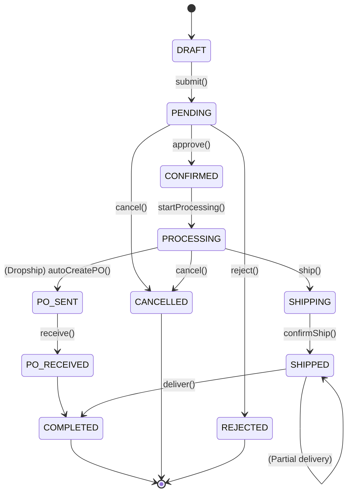
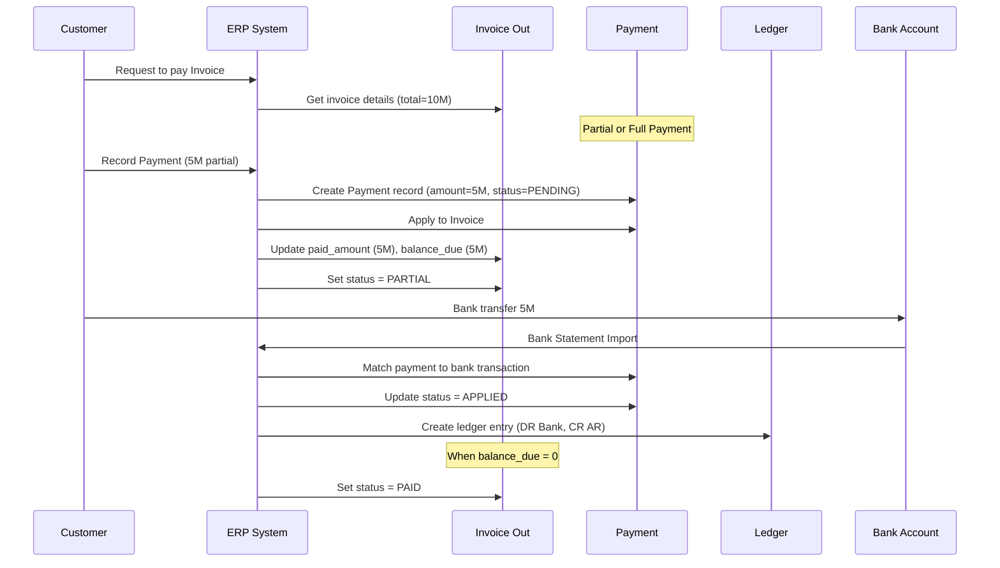
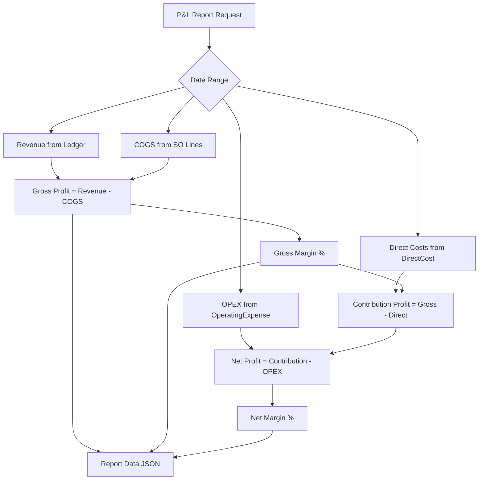
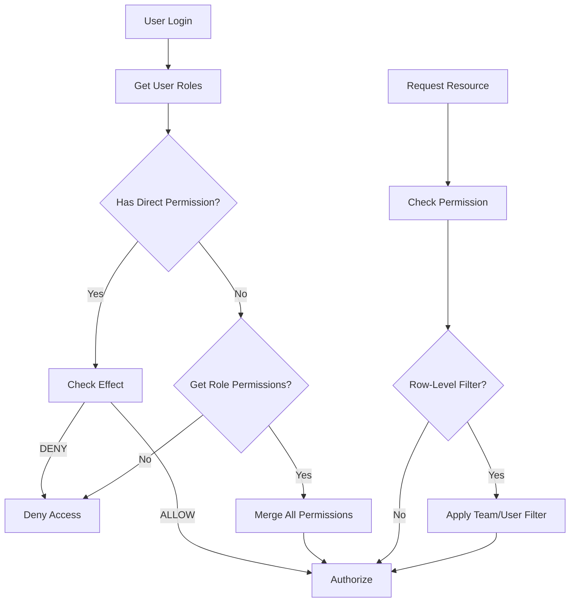

# ERP MASTER PLAN
## Hệ Thống ERP Cho Doanh Nghiệp Thương Mại & Phân Phối

**Version:** 1.2  
**Ngày:** 2026-06-30  
**Tác giả:** System Architect Agent  
**Trạng thái:** Master Architecture Document (Đã sửa Tech Stack + RBAC)

---

## MỤC LỤC

1. [Tổng Quan Hệ Thống & Nguyên Lý Thiết Kế](#1-tổng-quan-hệ-thống--nguyên-lý-thiết-kế)
2. [KHỐI 1: Quản Lý Đơn Hàng & Kho Bãi](#2-khối-1-quản-lý-đơn-hàng--kho-bãi)
3. [KHỐI 2: Tài Chính & Đối Soát Dòng Tiền](#3-khối-2-tài-chính--đối-soát-dòng-tiền)
4. [KHỐI 3: Kế Toán Quản Trị & Báo Cáo Lãi/Lỗ](#4-khối-3-kế-toán-quản-trị--báo-cáo-lãilỗ)
5. [KHỐI 4: Phân Quyền & Bảo Mật (RBAC)](#5-khối-4-phân-quyền--bảo-mật-rbac)
6. [KHỐI 5: Quản Lý Nhân Sự & Lương](#6-khối-5-quản-lý-nhân-sự--lương)
7. [KHỐI 6: Quan Hệ Khách Hàng & Nhà Cung Cấp](#7-khối-6-quan-hệ-khách-hàng--nhà-cung-cấp)
8. [Database Architecture & Schema Design](#8-database-architecture--schema-design)
9. [Integration & Cross-Cutting Concerns](#9-integration--cross-cutting-concerns)
10. [Lộ Trình Triển Khai](#10-lộ-trình-triển-khai)
11. [Technology Stack (Next.js/NestJS/Prisma)](#11-technology-stack)
12. [Phụ Lục: Mermaid Diagrams](#12-phụ-lục-mermaid-diagrams)

---

## 1. TỔNG QUAN HỆ THỐNG & NGUYÊN LÝ THIẾT KẾ

### 1.1 Mô Hình Tổng Thể (4-Layer Architecture)

```
┌─────────────────────────────────────────────────────────────────────────────┐
│                           PRESENTATION LAYER                                │
│   Next.js 14 App Router (Web) │ React Admin Dashboard │ Mobile (TBD)     │
├─────────────────────────────────────────────────────────────────────────────┤
│                            SERVICE LAYER                                    │
│   NestJS Controllers │ Business Services │ Validation │ Event Bus          │
├─────────────────────────────────────────────────────────────────────────────┤
│                           DOMAIN LAYER                                      │
│   Order │ Inventory │ Finance │ Accounting │ RBAC │ HR │ CRM ─► Events     │
├─────────────────────────────────────────────────────────────────────────────┤
│                         INFRASTRUCTURE LAYER                               │
│   PostgreSQL │ Prisma ORM │ Redis │ S3/Cloudinary │ Payment Gateway       │
└─────────────────────────────────────────────────────────────────────────────┘
```

### 1.2 Nguyên Lý Thiết Kế Cốt Lõi

```
┌────────────────────────────────────────────────────────────────────────────┐
│                        5 NGUYÊN LÝ VÀNG                                   │
│                                                                            │
│  1. SEPARATION OF CONCERNS (Tách bạch nghiệp vụ)                          │
│     └─► Không bao giờ gộp "Tồn kho vật lý" với "Công nợ" trong 1 table  │
│     └─► Không bao giờ gộp "Hóa đơn" với "Thanh toán" trong 1 table       │
│                                                                            │
│  2. EVENT-DRIVEN (Sự kiện dẫn dắt trạng thái)                            │
│     └─► State Machine khóa cứng luồng đi của đơn hàng                     │
│     └─► Mọi thay đổi trạng thái đều phát sinh Domain Event                │
│     └─► Event Handler cập nhật tồn kho / công nợ / ledger                │
│                                                                            │
│  3. IMMUTABLE AUDIT TRAIL (Chuỗi kiểm toán bất biến)                      │
│     └─► Mọi giao dịch đều có timestamp, user_id, audit log                │
│     └─► KHÔNG update trực tiếp, chỉ INSERT + reversal                     │
│     └─► Sửa = tạo điều chỉnh (Adjustment) + Ghi chú lý do               │
│                                                                            │
│  4. COST TRACKING AT LINE LEVEL (Giá vốn tại dòng sản phẩm)               │
│     └─► Mỗi dòng sản phẩm BẮT BUỘC có baseCost khi bán                    │
│     └─► Bắt buộc link với PO/Purchase để tính COGS chính xác              │
│     └─► Tách Direct Costs (gắn order) vs OPEX (không gắn order)           │
│                                                                            │
│  5. ACCRUAL BASIS (Cơ sở dồn tích)                                        │
│     └─► Ghi nhận doanh thu/khoản phải thu KHI GIAO HÀNG, không phải khi  │
│         thanh toán                                                        │
│     └─► Ghi nhận chi phí KHI NHẬN HÀNG, không phải khi trả tiền          │
│                                                                            │
└────────────────────────────────────────────────────────────────────────────┘
```

### 1.3 Mô Hình Phân Phối Song Song

```
┌─────────────────────────────────────────────────────────────────────────────┐
│                    2 LUỒNG PHÂN PHỐI SONG SONG                             │
│                                                                              │
│   ┌─────────────────────────────────┐    ┌─────────────────────────────────┐ │
│   │        WAREHOUSE FLOW           │    │        DROPSHIP FLOW             │ │
│   │         (Kho vật lý)            │    │       (Giao thẳng)              │ │
│   └─────────────────────────────────┘    └─────────────────────────────────┘ │
│                    │                                     │                  │
│                    ▼                                     ▼                  │
│   ┌─────────────────────────────────┐    ┌─────────────────────────────────┐ │
│   │ 1. PURCHASE ORDER (PO)          │    │ 1. SALES ORDER (SO) - DROPSHIP │ │
│   │    └─► Goods Receipt            │    │    └─► Auto-generate linked PO  │ │
│   │       └─► +Inventory Stock     │    │       └─► NO inventory change   │ │
│   │                                  │    │                                  │ │
│   │ 2. SALES ORDER (SO)             │    │ 2. PURCHASE ORDER (linked PO)  │ │
│   │    └─► SHIPPED status          │    │    └─► Supplier ships direct    │ │
│   │       └─► -Inventory Stock     │    │    └─► Supplier Invoice In      │ │
│   │    └─► Invoice Out            │    │                                  │ │
│   │                                  │    │ 3. Invoice Out                 │ │
│   │ 3. Payment & Reconciliation    │    │    └─► Customer pays            │ │
│   └─────────────────────────────────┘    │                                  │ │
│                                          │ 4. Payment & Reconciliation     │ │
│                                          └─────────────────────────────────┘ │
│                                                                              │
│   KEY DIFFERENCE:                                                           │
│   • WAREHOUSE: Stock changes physically (IN → OUT)                           │
│   • DROPSHIP:  Stock = 0 change. Money flows, not goods.                    │
│                                                                              │
└─────────────────────────────────────────────────────────────────────────────┘
```

---

## 2. KHỐI 1: QUẢN LÝ ĐƠN HÀNG & KHO BÃI

### 2.1 Tách Bạch HOÀN TOÀN Sales Order và Purchase Order

```
┌────────────────────────────────────────────────────────────────────────────┐
│                    SALES ORDER vs PURCHASE ORDER                           │
│                                                                            │
│  SALES ORDER (Đơn Bán)              │  PURCHASE ORDER (Đơn Mua)            │
│  ────────────────────────────────────┼──────────────────────────────────  │
│  Direction: OUT (bán ra)             │  Direction: IN (mua vào)             │
│  Counterparty: Customer              │  Counterparty: Supplier              │
│  Revenue recognition: on SHIP       │  Expense recognition: on RECEIVE       │
│  Reduces: Inventory Stock           │  Increases: Inventory Stock           │
│  AR (Accounts Receivable)           │  AP (Accounts Payable)               │
│  Invoice: Invoice Out               │  Invoice: Invoice In                │
│  Payment from: Customer             │  Payment to: Supplier                │
│                                                                            │
│  LINK FIELD:                                                                   │
│  ┌────────────────┐                    ┌────────────────┐               │
│  │  SalesOrder    │◄── linked_order_id ──│ PurchaseOrder  │               │
│  │  (DROPSHIP)   │                     │  (auto-gen)    │               │
│  └────────────────┘                    └────────────────┘               │
│                                                                            │
│  WAREHOUSE FLOW:     SO only ──────────► Ship ──────────► InvoiceOut       │
│  DROPSHIP FLOW:      SO + auto-PO ─────► Ship ──────────► InvoiceOut      │
│                                                                            │
└────────────────────────────────────────────────────────────────────────────┘
```

### 2.2 State Machine Cho Đơn Hàng

```
SALES ORDER STATE MACHINE
━━━━━━━━━━━━━━━━━━━━━━━━━━━━━━━━━━━━━━━━━━━━━━━━━━━━━━━━━━━━━━━━━━━━━━━━━━━━━━━

                              ┌──────────────┐
                              │    DRAFT    │ (Khởi tạo, chưa gửi)
                              └──────┬───────┘
                                     │ submit()
                              ┌──────▼───────┐
                              │   PENDING    │ (Chờ duyệt)
                              └──────┬───────┘
                                     │ approve()
                    ┌────────────────┼────────────────┐
                    │                │                │
           ┌────────▼────────┐ ┌─────▼──────┐ ┌──────▼─────────┐
           │   CONFIRMED     │ │  CANCELLED  │ │    REJECTED    │
           │   (Đã duyệt)   │ │  (Đã hủy)   │ │   (Từ chối)   │
           └────────┬────────┘ └─────────────┘ └─────────────────┘
                    │
                    │ startProcessing()
           ┌────────▼────────┐
           │   PROCESSING    │ (Đang xử lý)
           └────────┬────────┘
                    │
          ┌─────────┼─────────┐
          │ dropship │ warehouse│
    ┌─────▼───┐       ┌──────▼──────┐
    │ AUTO-PO │       │  SHIPPING   │
    │created  │       │  (Xuất kho) │
    └─────┬───┘       └──────┬──────┘
          │                  │ shipped()
    ┌─────▼───┐       ┌──────▼──────┐
    │  PO     │       │   SHIPPED   │ ◄── CRITICAL: Inventory decremented HERE
    │ SENT    │       │ (Đã giao)  │
    └─────┬───┘       └──────┬──────┘
          │                  │
          │ receive()        │ delivered()
    ┌─────▼───┐       ┌──────▼──────┐
    │RECEIVED │       │  COMPLETED  │ (Đơn hoàn thành)
    └─────────┘       └─────────────┘


INVENTORY STOCK: CHỈ THAY ĐỔI KHI status = SHIPPED (Warehouse) HOẶC = RECEIVED (PO)
━━━━━━━━━━━━━━━━━━━━━━━━━━━━━━━━━━━━━━━━━━━━━━━━━━━━━━━━━━━━━━━━━━━━━━━━━━━━━━━

  Stock Movement Logic:
  
  IF order_type == "WAREHOUSE" AND status == "SHIPPED":
      FOR EACH line IN order_lines:
          inventory.decrement(line.product_id, line.quantity)
          inventory_log.create(
              type = "SALE",
              order_id = order.id,
              product_id = line.product_id,
              quantity = -line.quantity,  // NEGATIVE
              warehouse_id = order.warehouse_id
          )
  
  IF order_type == "PURCHASE" AND status == "RECEIVED":
      FOR EACH line IN order_lines:
          inventory.increment(line.product_id, line.quantity)
          inventory_log.create(
              type = "PURCHASE",
              order_id = order.id,
              product_id = line.product_id,
              quantity = +line.quantity,  // POSITIVE
              warehouse_id = order.warehouse_id
          )
```

### 2.3 Mô Hình Kho Vật Lý (Multi-Warehouse)

```
┌─────────────────────────────────────────────────────────────────────────────┐
│                         MULTI-WAREHOUSE MODEL                               │
│                                                                              │
│   ┌──────────────────────────────────────────────────────────────────────┐ │
│   │ WAREHOUSE                                                             │ │
│   │ ├── id (UUID)                                                         │ │
│   │ ├── code (WH-001)                                                     │ │
│   │ ├── name (Kho Hà Nội)                                                 │ │
│   │ ├── type (OWN | THIRD_PARTY | VIRTUAL)                                │ │
│   │ ├── address                                                           │ │
│   │ ├── is_default                                                        │ │
│   │ └── status (ACTIVE | INACTIVE)                                        │ │
│   └──────────────────────────────────────────────────────────────────────┘ │
│                                    │                                        │
│                                    ▼                                        │
│   ┌──────────────────────────────────────────────────────────────────────┐ │
│   │ INVENTORY (TỒN KHO)                                                   │ │
│   │ ├── product_id (FK)                                                   │ │
│   │ ├── warehouse_id (FK)                                                 │ │
│   │ ├── quantity_on_hand (Tồn thực tế)                                    │ │
│   │ ├── quantity_reserved (Đã đặt hàng, chưa ship)                        │ │
│   │ ├── quantity_available (Tồn khả dụng = on_hand - reserved)             │ │
│   │ ├── quantity_in_transit (Đang chuyển)                                  │ │
│   │ ├── average_cost (Giá vốn TB = COGS/unit)                             │ │
│   │ └── last_updated                                                       │ │
│   └──────────────────────────────────────────────────────────────────────┘ │
│                                    │                                        │
│                                    ▼                                        │
│   ┌──────────────────────────────────────────────────────────────────────┐ │
│   │ INVENTORY MOVEMENT LOG                                                │ │
│   │ ├── id                                                                │ │
│   │ ├── product_id                                                        │ │
│   │ ├── warehouse_id                                                      │ │
│   │ ├── type (PURCHASE | SALE | ADJUSTMENT | TRANSFER | RETURN)          │ │
│   │ ├── quantity (dương = nhập, âm = xuất)                                │ │
│   │ ├── unit_cost (Giá vốn tại thời điểm)                                │ │
│   │ ├── total_value (quantity × unit_cost)                                │ │
│   │ ├── reference_type (SalesOrder | PurchaseOrder | Manual | ...)        │ │
│   │ ├── reference_id                                                      │ │
│   │ ├── reason (Ghi chú: "Bán hàng", "Nhập kho", "Kiểm kho", ...)       │ │
│   │ ├── created_by                                                        │ │
│   │ └── created_at                                                        │ │
│   └──────────────────────────────────────────────────────────────────────┘ │
│                                                                              │
└─────────────────────────────────────────────────────────────────────────────┘
```

### 2.4 Dropship Auto-PO Logic

```php
// Pseudo-code: Tự động sinh PurchaseOrder khi tạo Dropship SalesOrder

class SalesOrderService
{
    public function createDropshipOrder(array $data): SalesOrder
    {
        return DB::transaction(function () use ($data) {
            
            // 1. Tạo Sales Order với type = DROPSHIP
            $salesOrder = SalesOrder::create([
                'type' => 'DROPSHIP',
                'customer_id' => $data['customer_id'],
                'status' => 'PENDING',
                // ... other fields
            ]);

            // 2. Tự động sinh Purchase Order đối ứng
            $linkedPO = PurchaseOrder::create([
                'type' => 'DROPSHIP_LINKED',
                'linked_sales_order_id' => $salesOrder->id,
                'supplier_id' => $this->resolveSupplier($data['lines']), // Map supplier
                'status' => 'DRAFT',
            ]);

            // 3. Map từng dòng SO -> PO
            foreach ($data['lines'] as $soLine) {
                $poLine = PurchaseOrderLine::create([
                    'purchase_order_id' => $linkedPO->id,
                    'product_id' => $soLine['product_id'],
                    'quantity' => $soLine['quantity'],
                    'unit_cost' => $this->getSupplierPrice($soLine['product_id'], $supplier->id),
                    // baseCost = đơn giá mua (chưa biết, có thể cập nhật sau)
                ]);

                // Link dòng SO với dòng PO
                SalesOrderLine::create([
                    'sales_order_line_id' => $soLine['id'],
                    'purchase_order_line_id' => $poLine->id,
                ]);
            }

            // 4. Phát sự kiện
            event(new DropshipOrderCreated($salesOrder, $linkedPO));

            return $salesOrder;
        });
    }
}
```

### 2.5 Data Models (Prisma-style)

```prisma
// KHỐI 1: ORDER & INVENTORY

model Warehouse {
  id        String   @id @default(cuid())
  code      String   @unique
  name      String
  type      WarehouseType // OWN, THIRD_PARTY, VIRTUAL
  address   String?
  isDefault Boolean  @default(false) @map("is_default")
  
  inventories Inventory[]
  movements   InventoryMovement[]
  
  createdAt DateTime @default(now())
  updatedAt DateTime @updatedAt
  
  @@map("warehouses")
}

model Product {
  id             String   @id @default(cuid())
  sku            String   @unique
  name           String
  description    String?
  unit           String   @default("piece") // cái, kg, lít...
  categoryId     String?  @map("category_id")
  category       Category? @relation(fields: [categoryId], references: [id])
  
  // Pricing
  sellPrice      Decimal  @map("sell_price") @db.Decimal(15, 2)
  buyPrice       Decimal? @map("buy_price") @db.Decimal(15, 2)
  minStockLevel  Decimal? @map("min_stock_level") @db.Decimal(15, 2)
  
  // Stock
  isTrackStock   Boolean  @default(true) @map("is_track_stock")
  isActive       Boolean  @default(true) @map("is_active")
  
  // For P&L - baseCost sẽ được set tại dòng OrderLine
  inventories    Inventory[]
  salesOrderLines SalesOrderLine[]
  purchaseOrderLines PurchaseOrderLine[]
  movements      InventoryMovement[]
  
  createdAt DateTime @default(now())
  updatedAt DateTime @updatedAt
  
  @@map("products")
}

model Inventory {
  id                 String   @id @default(cuid())
  productId          String   @map("product_id")
  warehouseId        String   @map("warehouse_id")
  
  quantityOnHand     Decimal  @default(0) @map("quantity_on_hand") @db.Decimal(15, 3)
  quantityReserved   Decimal  @default(0) @map("quantity_reserved") @db.Decimal(15, 3)
  quantityInTransit  Decimal  @default(0) @map("quantity_in_transit") @db.Decimal(15, 3)
  
  // Computed: quantityAvailable = onHand - reserved
  averageCost        Decimal  @default(0) @map("average_cost") @db.Decimal(15, 2)
  
  product            Product   @relation(fields: [productId], references: [id])
  warehouse          Warehouse @relation(fields: [warehouseId], references: [id])
  
  updatedAt          DateTime @updatedAt
  
  @@unique([productId, warehouseId])
  @@map("inventories")
}

model InventoryMovement {
  id            String   @id @default(cuid())
  productId     String   @map("product_id")
  warehouseId   String   @map("warehouse_id")
  
  type          MovementType // PURCHASE, SALE, ADJUSTMENT, TRANSFER, RETURN
  quantity      Decimal  @db.Decimal(15, 3)  // âm = xuất, dương = nhập
  unitCost      Decimal  @map("unit_cost") @db.Decimal(15, 2)
  totalValue    Decimal  @map("total_value") @db.Decimal(15, 2) // quantity × unitCost
  
  // Reference to source document
  refType       RefType? // SALES_ORDER, PURCHASE_ORDER, MANUAL, TRANSFER
  refId         String?  @map("ref_id")
  
  reason        String?  // Mô tả lý do
  notes         String?
  
  createdBy     String   @map("created_by")
  createdAt     DateTime @default(now())
  
  product       Product   @relation(fields: [productId], references: [id])
  warehouse     Warehouse @relation(fields: [warehouseId], references: [id])
  
  @@index([productId, warehouseId, type])
  @@index([refType, refId])
  @@map("inventory_movements")
}

// ──────────────────────────────────────────────
// SALES ORDER
// ──────────────────────────────────────────────

model SalesOrder {
  id              String   @id @default(cuid())
  orderNumber     String   @unique  @map("order_number")
  type            OrderType // WAREHOUSE, DROPSHIP
  status          OrderStatus @default(DRAFT)
  
  customerId      String   @map("customer_id")
  customer        Customer @relation(fields: [customerId], references: [id])
  
  warehouseId     String?  @map("warehouse_id")  // NULL cho dropship
  warehouse       Warehouse? @relation(fields: [warehouseId], references: [id])
  
  orderDate       DateTime @map("order_date")
  shipDate        DateTime? @map("ship_date")
  
  // Financial summary (tính từ lines)
  subtotal        Decimal  @default(0) @map("subtotal") @db.Decimal(15, 2)
  discountAmount  Decimal  @default(0) @map("discount_amount") @db.Decimal(15, 2)
  taxAmount       Decimal  @default(0) @map("tax_amount") @db.Decimal(15, 2)
  totalAmount     Decimal  @default(0) @map("total_amount") @db.Decimal(15, 2)
  // totalCost để track LÃI: sum(baseCost × quantity)
  totalCost       Decimal  @default(0) @map("total_cost") @db.Decimal(15, 2) // Tổng COGS
  
  currency        String   @default("VND")
  exchangeRate    Decimal  @default(1) @map("exchange_rate") @db.Decimal(15, 4)
  
  notes           String?
  internalNotes   String?  @map("internal_notes")
  
  // Linked PO (cho dropship)
  linkedPurchaseOrderId String? @map("linked_purchase_order_id")
  linkedPurchaseOrder   PurchaseOrder? @relation("SalesToPurchase", fields: [linkedPurchaseOrderId], references: [id])
  
  // Invoice reference
  invoiceOutId    String?  @map("invoice_out_id")
  invoiceOut      InvoiceOut? @relation(fields: [invoiceOutId], references: [id])
  
  createdBy      String   @map("created_by")
  approvedBy     String?  @map("approved_by")
  
  lines          SalesOrderLine[]
  statusHistory  OrderStatusHistory[]
  
  createdAt DateTime @default(now())
  updatedAt DateTime @updatedAt
  
  @@index([customerId])
  @@index([status])
  @@index([orderDate])
  @@map("sales_orders")
}

model SalesOrderLine {
  id              String   @id @default(cuid())
  salesOrderId    String   @map("sales_order_id")
  salesOrder      SalesOrder @relation(fields: [salesOrderId], references: [id], onDelete: Cascade)
  
  productId       String   @map("product_id")
  product         Product   @relation(fields: [productId], references: [id])
  
  // Product snapshot (để không phụ thuộc khi product thay đổi)
  productSnapshot Json     @map("product_snapshot") // {sku, name, unit}
  
  quantity        Decimal  @db.Decimal(15, 3)
  unitPrice       Decimal  @map("unit_price") @db.Decimal(15, 2)
  
  // CRITICAL: baseCost là GIÁ VỐN tại thời điểm bán
  // Đây là field BẮT BUỘC cho P&L
  baseCost        Decimal  @map("base_cost") @db.Decimal(15, 2) 
  lineCost        Decimal  @map("line_cost") @db.Decimal(15, 2) // baseCost × quantity = COGS dòng
  
  discountPercent Decimal  @default(0) @map("discount_percent") @db.Decimal(5, 2)
  discountAmount Decimal  @default(0) @map("discount_amount") @db.Decimal(15, 2)
  taxPercent     Decimal  @default(0) @map("tax_percent") @db.Decimal(5, 2)
  lineTotal      Decimal  @map("line_total") @db.Decimal(15, 2) // sau VAT
  
  // Direct costs gắn với dòng này
  directCosts     Decimal  @default(0) @map("direct_costs") @db.Decimal(15, 2) // phí bốc vác, ship...
  
  // Linked PO Line (cho dropship)
  linkedPurchaseOrderLineId String? @map("linked_purchase_order_line_id")
  
  sortOrder       Int      @default(0) @map("sort_order")
  
  createdAt DateTime @default(now())
  
  @@index([salesOrderId])
  @@map("sales_order_lines")
}

// ──────────────────────────────────────────────
// PURCHASE ORDER
// ──────────────────────────────────────────────

model PurchaseOrder {
  id              String   @id @default(cuid())
  orderNumber     String   @unique  @map("order_number")
  type            OrderType // WAREHOUSE, DROPSHIP_LINKED
  status          OrderStatus @default(DRAFT)
  
  supplierId      String   @map("supplier_id")
  supplier        Supplier  @relation(fields: [supplierId], references: [id])
  
  warehouseId     String?  @map("warehouse_id")  // NULL cho dropship
  warehouse       Warehouse? @relation(fields: [warehouseId], references: [id])
  
  orderDate       DateTime @map("order_date")
  receiveDate     DateTime? @map("receive_date")
  
  subtotal        Decimal  @default(0) @map("subtotal") @db.Decimal(15, 2)
  discountAmount  Decimal  @default(0) @map("discount_amount") @db.Decimal(15, 2)
  taxAmount       Decimal  @default(0) @map("tax_amount") @db.Decimal(15, 2)
  totalAmount     Decimal  @default(0) @map("total_amount") @db.Decimal(15, 2)
  
  currency        String   @default("VND")
  exchangeRate    Decimal  @default(1) @map("exchange_rate") @db.Decimal(15, 4)
  
  notes           String?
  
  // Linked Sales Order (cho dropship)
  linkedSalesOrderId String? @map("linked_sales_order_id")
  linkedSalesOrder   SalesOrder? @relation("SalesToPurchase", fields: [linkedSalesOrderId], references: [id])
  
  // Invoice reference
  invoiceInId     String?  @map("invoice_in_id")
  invoiceIn       InvoiceIn? @relation(fields: [invoiceInId], references: [id])
  
  createdBy      String   @map("created_by")
  approvedBy     String?  @map("approved_by")
  
  lines          PurchaseOrderLine[]
  statusHistory  OrderStatusHistory[]
  
  createdAt DateTime @default(now())
  updatedAt DateTime @updatedAt
  
  @@index([supplierId])
  @@index([status])
  @@map("purchase_orders")
}

model PurchaseOrderLine {
  id                String   @id @default(cuid())
  purchaseOrderId   String   @map("purchase_order_id")
  purchaseOrder     PurchaseOrder @relation(fields: [purchaseOrderId], references: [id], onDelete: Cascade)
  
  productId         String   @map("product_id")
  product           Product   @relation(fields: [productId], references: [id])
  
  productSnapshot   Json     @map("product_snapshot")
  
  quantity          Decimal  @db.Decimal(15, 3)
  orderedQuantity   Decimal  @default(0) @map("ordered_quantity") @db.Decimal(15, 3) // đã nhận
  receivedQuantity  Decimal  @default(0) @map("received_quantity") @db.Decimal(15, 3)
  
  unitCost          Decimal  @map("unit_cost") @db.Decimal(15, 2) // GIÁ MUA
  // baseCost sẽ = unitCost, dùng chung field cho SO Line
  
  discountPercent   Decimal  @default(0) @map("discount_percent") @db.Decimal(5, 2)
  discountAmount    Decimal  @default(0) @map("discount_amount") @db.Decimal(15, 2)
  taxPercent        Decimal  @default(0) @map("tax_percent") @db.Decimal(5, 2)
  lineTotal         Decimal  @map("line_total") @db.Decimal(15, 2)
  
  // Direct costs (VD: phí vận chuyển cho dòng này)
  directCosts       Decimal  @default(0) @map("direct_costs") @db.Decimal(15, 2)
  
  sortOrder         Int      @default(0) @map("sort_order")
  
  createdAt DateTime @default(now())
  
  @@index([purchaseOrderId])
  @@map("purchase_order_lines")
}

// ──────────────────────────────────────────────
// ORDER STATUS HISTORY (Audit Trail)
// ──────────────────────────────────────────────

model OrderStatusHistory {
  id            String   @id @default(cuid())
  
  // Polymorphic: có thể là SalesOrder hoặc PurchaseOrder
  orderType     OrderType @map("order_type")
  orderId       String   @map("order_id")
  
  fromStatus    OrderStatus? @map("from_status")
  toStatus      OrderStatus  @map("to_status")
  
  changedBy     String   @map("changed_by")
  changedAt     DateTime @default(now())
  reason        String?
  notes         String?
  
  @@index([orderType, orderId])
  @@map("order_status_history")
}
```

### 2.6 Enums

```prisma
enum OrderType {
  WAREHOUSE      // Mua về nhập kho → Bán ra từ kho
  DROPSHIP       // Bán giao thẳng, tự sinh PO đối ứng
  DROPSHIP_LINKED // PO được tạo tự động từ SO dropship
}

enum OrderStatus {
  DRAFT      // Nháp, chưa gửi
  PENDING    // Chờ duyệt
  CONFIRMED  // Đã duyệt, đang xử lý
  PROCESSING // Đang xử lý (PO: đã gửi NCC)
  SHIPPING   // Đang giao hàng (SO: đang xuất kho)
  SHIPPED    // Đã giao hàng (SO)
  RECEIVED   // Đã nhận hàng (PO)
  COMPLETED  // Hoàn thành
  CANCELLED  // Hủy
  REJECTED   // Từ chối
}

enum MovementType {
  PURCHASE   // Nhập kho từ PO
  SALE       // Xuất kho bán hàng
  ADJUSTMENT // Điều chỉnh tồn kho (thủ công)
  TRANSFER   // Chuyển kho
  RETURN_IN  // Trả lại nhà cung cấp
  RETURN_OUT // Khách hàng trả lại
  DAMAGE     // Hàng hỏng
}

enum RefType {
  SALES_ORDER
  PURCHASE_ORDER
  MANUAL
  TRANSFER_ORDER
  DAMAGE_REPORT
}

enum WarehouseType {
  OWN          // Kho tự có
  THIRD_PARTY  // Kho thuê ngoài
  VIRTUAL      // Kho ảo (cho dropship)
}
```

---

## 3. KHỐI 2: TÀI CHÍNH & ĐỐI SOÁT DÒNG TIỀN

### 3.1 Tách Bạch AR/AP vs Sổ Quỹ

```
┌─────────────────────────────────────────────────────────────────────────────┐
│              TÁCH BẠCH AR/AP (Công nợ) vs LEDGER (Sổ quỹ)                  │
│                                                                              │
│   ┌───────────────────────────┐         ┌───────────────────────────────┐ │
│   │  ACCOUNTS RECEIVABLE (AR) │         │   CASH LEDGER (Sổ quỹ)          │ │
│   │  Công nợ phải thu         │         │   Biến động tiền thực tế        │ │
│   ├───────────────────────────┤         ├───────────────────────────────┤ │
│   │ Từ: Invoice Out            │         │ Từ: Thực nhận tiền              │ │
│   │ Tăng: Khi xuất hóa đơn   │         │ Tăng: +Customer Payment        │ │
│   │ Giảm: Khi khách thanh toán│         │ Giảm: -Supplier Payment        │ │
│   │ Tính: Số dư CÒN NỢ       │         │ Giảm: -Chi phí                 │ │
│   │                            │         │ Giảm: -Trả lương               │ │
│   │ Công thức:                 │         │                                │ │
│   │ AR = Invoices - Payments  │         │ Công thức:                      │ │
│   │       - Credits           │         │ Balance = Σ inflows - Σ outflows│ │
│   └───────────────────────────┘         └───────────────────────────────┘ │
│                    │                                    │                  │
│                    │            ┌──────────────────────┘                  │
│                    │            │                                           │
│                    ▼            ▼                                           │
│   ┌───────────────────────────────────────────────────────────────────┐   │
│   │              RECONCILIATION (Đối soát)                            │   │
│   │  Map một Payment cụ thể với một Invoice cụ thể (hoặc gộp)       │   │
│   │                                                                   │   │
│   │  Payment #PMT-001: 5,000,000 VND                                 │   │
│   │  └─► Applied to: Invoice #INV-001 (3,000,000)                    │   │
│   │  └─► Applied to: Invoice #INV-002 (2,000,000)                   │   │
│   │  └─► Remaining: 0                                                 │   │
│   │                                                                   │   │
│   │  Sau khi reconcile:                                               │   │
│   │  • Invoice #INV-001: status → PAID                               │   │
│   │  • Invoice #INV-002: status → PAID                               │   │
│   │  • AR: giảm 5,000,000                                            │   │
│   │  • Cash: tăng 5,000,000                                         │   │
│   │                                                                   │   │
│   └───────────────────────────────────────────────────────────────────┘   │
│                                                                              │
└─────────────────────────────────────────────────────────────────────────────┘
```

### 3.2 Mô Hình Thanh Toán (Multi-Payment)

```
┌─────────────────────────────────────────────────────────────────────────────┐
│                       PAYMENT MODELS                                        │
│                                                                              │
│  ┌─────────────┐     ┌─────────────────────┐     ┌─────────────────────┐  │
│  │   Payment   │────►│  PaymentApplication  │◄───│     InvoiceOut      │  │
│  │ (Một lần    │     │  (Áp dụng thanh     │     │   (Hóa đơn bán)     │  │
│  │  thanh toán)│     │   toán cho invoice) │     │                     │  │
│  └─────────────┘     └─────────────────────┘     └─────────────────────┘  │
│         │                           ▲                                       │
│         │                           │                                       │
│         │              ┌─────────────────────┐                             │
│         └─────────────►│  ClearingTransaction │◄── Bank Import / MT940 │
│                        │  (Đối soát tự động)  │     (Import sao kê)      │
│                        └─────────────────────┘                             │
│                                                                              │
└─────────────────────────────────────────────────────────────────────────────┘

PAYMENT (Thanh toán)
├── id
├── customer_id / supplier_id  (nullable - có thể thanh toán không chỉ định)
├── payment_method (CASH, BANK_TRANSFER, E_WALLET, QR_PAY, CARD, PLATFORM)
├── amount (Tổng số tiền)
├── currency
├── payment_date
├── reference (Mã giao dịch ngân hàng)
├── bank_account_id (Tài khoản nhận tiền)
├── status (PENDING | APPLIED | FAILED | REFUNDED)
├── notes
├── created_by
└── applied_amount (Tính tự động: đã áp dụng vào invoice)

PaymentApplication (Áp dụng cho invoice)
├── id
├── payment_id (FK)
├── invoice_out_id (FK - nullable cho trường hợp ghi nhận tiền nhưng chưa chỉ định invoice)
├── amount_applied (Số tiền áp dụng cho invoice này)
├── applied_at
└── notes

InvoiceOut (Hóa đơn bán)
├── total (Tổng hóa đơn)
├── paid_amount (Đã thanh toán)
├── balance_due (Còn phải thu = total - paid_amount)
├── status (DRAFT | ISSUED | PARTIAL | PAID | OVERDUE | CANCELLED)
└── due_date

INVOICE STATUS LOGIC:
  • balance_due == total → DRAFT/ISSUED (chưa trả)
  • balance_due > 0 AND paid_amount > 0 → PARTIAL (trả một phần)
  • balance_due == 0 → PAID (đã trả đủ)
  • due_date < today AND balance_due > 0 → OVERDUE (quá hạn)
```

### 3.3 Tài Khoản Trung Gian (Clearing Account) — Xử Lý Sàn TMĐT

```
┌─────────────────────────────────────────────────────────────────────────────┐
│           XỬ LÝ THANH TOÁN TỪ SÀN TMĐT (Shopee, Lazada, Tiki...)           │
│                                                                              │
│   BÀI TOÁN:                                                                 │
│   ─────────────────────────────────────────────────────────────────────────  │
│   Khách hàng thanh toán trên sàn → Sàn giữ tiền → Sàn trả cho shop         │
│   sau vài ngày, trừ phí → Số tiền nhận ≠ số tiền khách thanh toán          │
│                                                                              │
│   GIẢI PHÁP: Tài khoản Trung Gian (Clearing Account)                        │
│                                                                              │
│   STEP 1: Khách thanh toán trên Shopee (100,000đ)                          │
│   ─────────────────────────────────────────────────────────────────────────  │
│   Customer pays: 100,000đ                                                   │
│   → Ghi nhận:                                                               │
│     DR Cash/Bank (Platform Clearing)    97,500đ                             │
│     DR Bank Fees Expense                   2,500đ                          │
│     CR Revenue/Sales                    100,000đ                             │
│                                                                              │
│   STEP 2: Sàn thanh toán cho shop (sau 3 ngày, trừ phí)                   │
│   ─────────────────────────────────────────────────────────────────────────  │
│   Clearing Account Balance: -97,500đ → 0                                    │
│   → Ghi nhận:                                                               │
│     DR Bank (Thực nhận)                97,500đ                               │
│     CR Platform Clearing Account       97,500đ                             │
│                                                                              │
│   STEP 3: Đối soát tự động (Bank Statement Import)                          │
│   ─────────────────────────────────────────────────────────────────────────  │
│   • Import sao kê ngân hàng (MT940 / CSV)                                   │
│   • Hệ thống match với Payments chờ                                          │
│   • Tự động apply payment → invoice                                         │
│   • Tạo ClearingTransaction để audit                                        │
│                                                                              │
│   ┌──────────────────────────────────────────────────────────────────────┐  │
│   │ PLATFORM_CLEARING_ACCOUNT (Tài khoản trung gian sàn)                  │  │
│   │ ──────────────────────────────────────────────────────────────────   │  │
│   │  Nợ phải thu tạm (Shopee chưa trả)                                  │  │
│   │  Số dư = Tổng tiền khách thanh toán trên sàn - Đã nhận thực tế      │  │
│   │                                                                       │  │
│   │  When reconciled:                                                    │  │
│   │    DR Bank (real account)        97,500                              │  │
│   │    CR Platform Clearing          97,500  ← clear the temp record     │  │
│   │    DR Platform Fees               2,500  ← expense                    │  │
│   │    CR Platform Clearing           2,500  ← also clear                │  │
│   └──────────────────────────────────────────────────────────────────────┘  │
│                                                                              │
└─────────────────────────────────────────────────────────────────────────────┘
```

### 3.4 Bulk Payment (Gom Đơn Thanh Toán)

```
┌─────────────────────────────────────────────────────────────────────────────┐
│                    BULK PAYMENT (Gom đơn thanh toán)                        │
│                                                                              │
│   Tình huống: KH "Công ty A" có 5 đơn hàng, trả 1 lần cho cả 5            │
│                                                                              │
│   Invoice #1: 10,000,000 │ Invoice #2:  8,000,000 │ Invoice #3: 15,000,000 │
│   Invoice #4:  5,000,000 │ Invoice #5: 12,000,000 │                        │
│   ───────────────────────────────────────────────────────────────────────── │
│   Tổng: 50,000,000 VND                                                     │
│                                                                              │
│   ┌──────────────────────────────────────────────────────────────────────┐  │
│   │ BulkPayment (1 bản ghi)                                              │  │
│   │  ├── customer_id: Công ty A                                          │  │
│   │  ├── total_amount: 50,000,000                                        │  │
│   │  ├── payment_method: BANK_TRANSFER                                   │  │
│   │  ├── payment_date: 2024-01-25                                        │  │
│   │  ├── reference: "TT đơn hàng 01-05/01"                              │  │
│   │  └── status: COMPLETED                                                │  │
│   └──────────────────────────────────────────────────────────────────────┘  │
│                                   │                                         │
│                                   ▼                                         │
│   ┌──────────────────────────────────────────────────────────────────────┐  │
│   │ BulkPaymentApplication (5 bản ghi)                                    │  │
│   │                                                                       │  │
│   │  bulk_payment_id | invoice_out_id | amount_applied | notes            │  │
│   │  ────────────────────────────────────────────────────────────────     │  │
│   │  BP-001           | INV-001         | 10,000,000     | Đơn #SO-001   │  │
│   │  BP-001           | INV-002         |  8,000,000     | Đơn #SO-002   │  │
│   │  BP-001           | INV-003         | 15,000,000     | Đơn #SO-003   │  │
│   │  BP-001           | INV-004         |  5,000,000     | Đơn #SO-004   │  │
│   │  BP-001           | INV-005         | 12,000,000     | Đơn #SO-005   │  │
│   │                                                                       │  │
│   └──────────────────────────────────────────────────────────────────────┘  │
│                                                                              │
└─────────────────────────────────────────────────────────────────────────────┘
```

### 3.5 Data Models — KHỐI 2

```prisma
// KHỐI 2: FINANCE & RECONCILIATION

// ──────────────────────────────────────────────
// CASH LEDGER (Sổ quỹ thực tế)
// ──────────────────────────────────────────────

model BankAccount {
  id           String   @id @default(cuid())
  code         String   @unique
  name         String
  accountNumber String?  @map("account_number")
  bankName     String?  @map("bank_name")
  accountType  BankAccountType // CHECKING, SAVINGS, PLATFORM_CLEARING, WALLET
  
  openingBalance Decimal @default(0) @map("opening_balance") @db.Decimal(15, 2)
  openingDate    DateTime @map("opening_date")
  
  isActive     Boolean  @default(true) @map("is_active")
  isDefault    Boolean  @default(false) @map("is_default")
  
  // Platform link (cho sàn TMĐT)
  platformId   String?  @map("platform_id")
  
  transactions BankTransaction[]
  ledgerEntries LedgerEntry[]
  
  createdAt DateTime @default(now())
  updatedAt DateTime @updatedAt
  
  @@map("bank_accounts")
}

model BankTransaction {
  id              String   @id @default(cuid())
  bankAccountId   String   @map("bank_account_id")
  bankAccount     BankAccount @relation(fields: [bankAccountId], references: [id])
  
  transactionDate DateTime @map("transaction_date")
  postDate       DateTime? @map("post_date")
  
  type            TxType // DEPOSIT, WITHDRAWAL, TRANSFER_IN, TRANSFER_OUT, FEE, INTEREST
  amount          Decimal @db.Decimal(15, 2) // Dương = nhập, Âm = xuất
  balance         Decimal @map("balance") @db.Decimal(15, 2) // Số dư sau giao dịch
  
  reference       String?  // Mã giao dịch ngân hàng
  description     String?
  
  // Reconciliation
  status          ReconStatus @default(UNRECONCILED)
  matchedPaymentId String?   @map("matched_payment_id")
  matchedPayment   Payment?   @relation(fields: [matchedPaymentId], references: [id])
  
  // Import tracking
  importBatchId   String?   @map("import_batch_id")
  rawData         Json?     @map("raw_data") // Dữ liệu gốc từ import
  
  createdAt DateTime @default(now())
  
  @@index([bankAccountId, transactionDate])
  @@index([status])
  @@map("bank_transactions")
}

// ──────────────────────────────────────────────
// LEDGER (Sổ sách kế toán) - Double Entry
// ──────────────────────────────────────────────

model LedgerEntry {
  id              String   @id @default(cuid())
  entryDate       DateTime @map("entry_date")
  voucherNumber   String   @unique @map("voucher_number") // PC001, PT001, BK001...
  
  // Journal loại gì?
  journalType     JournalType // PAYMENT_IN, PAYMENT_OUT, JOURNAL, OPENING
  
  description     String?
  amount          Decimal @db.Decimal(15, 2)
  currency        String  @default("VND")
  
  // Reference
  refType        RefType? // PAYMENT, INVOICE_IN, INVOICE_OUT, DIRECT_COST...
  refId          String?  @map("ref_id")
  
  bankAccountId  String?  @map("bank_account_id")
  bankAccount     BankAccount? @relation(fields: [bankAccountId], references: [id])
  
  createdBy      String   @map("created_by")
  
  // Double entry lines
  lines          LedgerEntryLine[]
  
  createdAt DateTime @default(now())
  
  @@index([entryDate])
  @@index([journalType])
  @@map("ledger_entries")
}

model LedgerEntryLine {
  id              String   @id @default(cuid())
  ledgerEntryId   String   @map("ledger_entry_id")
  ledgerEntry     LedgerEntry @relation(fields: [ledgerEntryId], references: [id], onDelete: Cascade)
  
  accountId       String   @map("account_id")  // Chart of Accounts
  account         Account   @relation(fields: [accountId], references: [id])
  
  dc              EntryDC  // DEBIT hoặc CREDIT
  amount          Decimal @db.Decimal(15, 2)
  
  description     String?
  
  // Analytics
  departmentId    String?  @map("department_id")
  projectId       String?  @map("project_id")
  
  // Cost tracking - gắn với order để tính LÃI GỘP
  salesOrderId    String?  @map("sales_order_id")
  salesOrder      SalesOrder? @relation(fields: [salesOrderId], references: [id])
  
  @@index([ledgerEntryId])
  @@map("ledger_entry_lines")
}

// ──────────────────────────────────────────────
// INVOICES
// ──────────────────────────────────────────────

model InvoiceOut {
  id              String   @id @default(cuid())
  invoiceNumber   String   @unique @map("invoice_number")
  salesOrderId    String?  @map("sales_order_id")
  salesOrder      SalesOrder? @relation(fields: [salesOrderId], references: [id])
  
  customerId      String   @map("customer_id")
  customer        Customer  @relation(fields: [customerId], references: [id])
  
  invoiceDate     DateTime @map("invoice_date")
  dueDate         DateTime @map("due_date")
  
  // CRITICAL: Financial fields
  subtotal        Decimal  @default(0) @db.Decimal(15, 2)
  discountAmount  Decimal  @default(0) @map("discount_amount") @db.Decimal(15, 2)
  taxAmount       Decimal  @default(0) @map("tax_amount") @db.Decimal(15, 2)
  total           Decimal  @default(0) @db.Decimal(15, 2)
  
  // Payment tracking
  paidAmount      Decimal  @default(0) @map("paid_amount") @db.Decimal(15, 2)
  balanceDue      Decimal  @default(0) @map("balance_due") @db.Decimal(15, 2)
  
  // Computed: balanceDue = total - paidAmount - creditsApplied
  // Computed: status tự động từ balanceDue
  
  currency        String   @default("VND")
  status          InvoiceStatus @default(DRAFT)
  
  taxRate         Decimal  @default(0.1) @map("tax_rate") @db.Decimal(5, 2)
  invoiceType     InvoiceType // FPT, DOMESTIC, EXPORT
  
  notes           String?
  
  paymentApplications PaymentApplication[]
  payments        Payment[]  @relation("InvoicePayments")
  
  createdBy      String   @map("created_by")
  
  createdAt DateTime @default(now())
  updatedAt DateTime @updatedAt
  
  @@index([customerId])
  @@index([status])
  @@index([dueDate])
  @@map("invoice_outs")
}

model InvoiceIn {
  id              String   @id @default(cuid())
  invoiceNumber   String   @unique @map("invoice_number")
  purchaseOrderId String?  @map("purchase_order_id")
  purchaseOrder   PurchaseOrder? @relation(fields: [purchaseOrderId], references: [id])
  
  supplierId      String   @map("supplier_id")
  supplier        Supplier  @relation(fields: [supplierId], references: [id])
  
  invoiceDate     DateTime @map("invoice_date")
  dueDate         DateTime @map("due_date")
  
  subtotal        Decimal  @default(0) @db.Decimal(15, 2)
  discountAmount  Decimal  @default(0) @map("discount_amount") @db.Decimal(15, 2)
  taxAmount       Decimal  @default(0) @map("tax_amount") @db.Decimal(15, 2)
  total           Decimal  @default(0) @db.Decimal(15, 2)
  
  paidAmount      Decimal  @default(0) @map("paid_amount") @db.Decimal(15, 2)
  balanceDue      Decimal  @default(0) @map("balance_due") @db.Decimal(15, 2)
  
  currency        String   @default("VND")
  status          InvoiceStatus @default(DRAFT)
  
  taxRate         Decimal  @default(0.1) @map("tax_rate") @db.Decimal(5, 2)
  
  notes           String?
  
  paymentApplications PaymentApplication[] @relation("SupplierPayments")
  
  createdBy      String   @map("created_by")
  
  createdAt DateTime @default(now())
  updatedAt DateTime @updatedAt
  
  @@index([supplierId])
  @@index([status])
  @@map("invoice_ins")
}

// ──────────────────────────────────────────────
// PAYMENTS
// ──────────────────────────────────────────────

model Payment {
  id              String   @id @default(cuid())
  paymentNumber   String   @unique @map("payment_number")
  
  // Ai trả? (Customer - AR) hoặc ai nhận? (Supplier - AP)
  partyType       PartyType // CUSTOMER, SUPPLIER
  partyId         String   @map("party_id")  // customer_id hoặc supplier_id
  
  paymentMethod   PaymentMethod // CASH, BANK_TRANSFER, E_WALLET, QR, CARD, PLATFORM
  
  amount          Decimal @db.Decimal(15, 2)
  currency        String  @default("VND")
  exchangeRate    Decimal @default(1) @map("exchange_rate") @db.Decimal(15, 4)
  
  paymentDate     DateTime @map("payment_date")
  
  // Nguồn tiền
  bankAccountId   String?  @map("bank_account_id")
  bankAccount     BankAccount? @relation(fields: [bankAccountId], references: [id])
  
  // Reference
  reference       String?  // Mã giao dịch ngân hàng, mã QR...
  
  // Applied amount (đã áp dụng cho invoice nào)
  appliedAmount   Decimal  @default(0) @map("applied_amount") @db.Decimal(15, 2)
  remainingAmount Decimal  @default(0) @map("remaining_amount") @db.Decimal(15, 2)
  // remainingAmount = amount - appliedAmount
  
  status          PaymentStatus @default(PENDING)
  
  // Bulk payment link
  bulkPaymentId   String?  @map("bulk_payment_id")
  bulkPayment     BulkPayment? @relation(fields: [bulkPaymentId], references: [id])
  
  notes           String?
  createdBy       String   @map("created_by")
  
  applications    PaymentApplication[]
  invoicesOut     InvoiceOut[] @relation("InvoicePayments")
  invoicesIn     InvoiceIn[]  @relation("SupplierPayments")
  matchedBankTx  BankTransaction?
  
  createdAt DateTime @default(now())
  updatedAt DateTime @updatedAt
  
  @@index([partyType, partyId])
  @@index([paymentDate])
  @@index([status])
  @@map("payments")
}

model PaymentApplication {
  id              String   @id @default(cuid())
  paymentId       String   @map("payment_id")
  payment         Payment   @relation(fields: [paymentId], references: [id])
  
  // Áp dụng cho InvoiceOut (AR) hoặc InvoiceIn (AP)
  invoiceOutId    String?  @map("invoice_out_id")
  invoiceOut      InvoiceOut? @relation(fields: [invoiceOutId], references: [id])
  invoiceInId     String?  @map("invoice_in_id")
  invoiceIn       InvoiceIn? @relation(fields: [invoiceInId], references: [id])
  
  amountApplied   Decimal @map("amount_applied") @db.Decimal(15, 2)
  appliedAt       DateTime @default(now()) @map("applied_at")
  
  notes           String?
  
  @@unique([paymentId, invoiceOutId])
  @@unique([paymentId, invoiceInId])
  @@map("payment_applications")
}

model BulkPayment {
  id              String   @id @default(cuid())
  bulkNumber      String   @unique @map("bulk_number")
  
  partyType       PartyType
  partyId         String   @map("party_id")
  
  totalAmount     Decimal @map("total_amount") @db.Decimal(15, 2)
  paymentMethod   PaymentMethod
  bankAccountId   String?  @map("bank_account_id")
  bankAccount     BankAccount? @relation(fields: [bankAccountId], references: [id])
  
  paymentDate     DateTime @map("payment_date")
  reference       String?
  description     String?
  
  status          BulkPaymentStatus @default(PENDING)
  
  createdBy       String   @map("created_by")
  createdAt       DateTime @default(now())
  
  applications    BulkPaymentApplication[]
  payments        Payment[]
  
  @@map("bulk_payments")
}

model BulkPaymentApplication {
  id              String   @id @default(cuid())
  bulkPaymentId   String   @map("bulk_payment_id")
  bulkPayment     BulkPayment @relation(fields: [bulkPaymentId], references: [id])
  
  invoiceOutId    String?  @map("invoice_out_id")
  invoiceOut      InvoiceOut? @relation(fields: [invoiceOutId], references: [id])
  invoiceInId     String?  @map("invoice_in_id")
  invoiceIn       InvoiceIn? @relation(fields: [invoiceInId], references: [id])
  
  amountApplied   Decimal @map("amount_applied") @db.Decimal(15, 2)
  
  notes           String?
  
  @@map("bulk_payment_applications")
}

// ──────────────────────────────────────────────
// PLATFORM CLEARING (Sàn TMĐT)
// ──────────────────────────────────────────────

model PlatformTransaction {
  id              String   @id @default(cuid())
  platformId      String   @map("platform_id")  // SHOPEE, LAZADA, TIKI
  platformOrderId String   @map("platform_order_id") // Mã đơn trên sàn
  
  // Tiền khách thanh toán trên sàn
  grossAmount     Decimal @map("gross_amount") @db.Decimal(15, 2)
  platformFee     Decimal @default(0) @map("platform_fee") @db.Decimal(15, 2)
  netAmount       Decimal @map("net_amount") @db.Decimal(15, 2) // = gross - fee
  
  // Tiền thực nhận khi sàn chuyển
  actualReceived  Decimal? @map("actual_received") @db.Decimal(15, 2)
  settlementDate  DateTime? @map("settlement_date")
  
  // Link to internal order
  salesOrderId    String?  @map("sales_order_id")
  salesOrder      SalesOrder? @relation(fields: [salesOrderId], references: [id])
  
  status          PlatformTxStatus @default(PENDING)
  
  rawData         Json?     @map("raw_data")
  createdAt       DateTime  @default(now())
  
  @@index([platformId, platformOrderId])
  @@map("platform_transactions")
}
```

### 3.6 Enums — KHỐI 2

```prisma
enum BankAccountType {
  CHECKING
  SAVINGS
  PLATFORM_CLEARING  // Tài khoản trung gian sàn
  WALLET
}

enum TxType {
  DEPOSIT
  WITHDRAWAL
  TRANSFER_IN
  TRANSFER_OUT
  FEE
  INTEREST
  ADJUSTMENT
}

enum ReconStatus {
  UNRECONCILED
  MATCHED
  DISPUTED
}

enum JournalType {
  PAYMENT_IN     // Phiếu thu
  PAYMENT_OUT    // Phiếu chi
  JOURNAL        // Bút toán điều chỉnh
  OPENING        // Số dư đầu kỳ
  CLOSING        // Số dư cuối kỳ
}

enum EntryDC {
  DEBIT
  CREDIT
}

enum InvoiceStatus {
  DRAFT
  ISSUED
  PARTIAL
  PAID
  OVERDUE
  CANCELLED
  CREDITED
}

enum InvoiceType {
  FPT        // Hóa đơn điện tử FPT
  DOMESTIC   // Hóa đơn trong nước
  EXPORT     // Hóa đơn xuất khẩu
}

enum PartyType {
  CUSTOMER
  SUPPLIER
}

enum PaymentMethod {
  CASH
  BANK_TRANSFER
  QR_PAY
  E_WALLET
  CARD
  PLATFORM     // Qua sàn TMĐT
}

enum PaymentStatus {
  PENDING    // Chờ xử lý
  APPLIED    // Đã áp dụng cho invoice
  FAILED     // Thất bại
  REFUNDED   // Hoàn tiền
  CANCELLED
}

enum BulkPaymentStatus {
  PENDING
  PROCESSING
  COMPLETED
  FAILED
}

enum PlatformTxStatus {
  PENDING      // Chờ sàn thanh toán
  SETTLED      // Sàn đã chuyển tiền
  DISPUTED     // Tranh chấp
}
```

---

## 4. KHỐI 3: KẾ TOÁN QUẢN TRỊ & BÁO CÁO LÃI/LỖ

### 4.1 Nguyên Tắc Vàng: baseCost Tại Dòng Sản Phẩm

```
┌─────────────────────────────────────────────────────────────────────────────┐
│              GIÁ VỐN (baseCost) PHẢI ĐƯỢC GHI TẠI DÒNG ORDER LINE          │
│                                                                              │
│   LÝ DO TẠI SAO ĐÂY LÀ NGUYÊN TẮC BẮT BUỘC:                               │
│                                                                              │
│   1. Mỗi lần mua có thể có giá khác nhau (market price thay đổi)           │
│   2. baseCost tại thời điểm BÁN mới là giá vốn đúng                       │
│   3. Doanh thu - baseCost = LÃI GỘP (Gross Profit)                        │
│   4. Nếu lưu baseCost ở Product, giá vốn sẽ sai khi giá mua thay đổi    │
│                                                                              │
│   VÍ DỤ THỰC TẾ:                                                           │
│                                                                              │
│   Product: Áo thun Nike                                                     │
│   ─────────────────────────────────────────────────────────────────────────  │
│   15/01: Mua 100 cái × 80,000 = 8,000,000  (PO-001)                       │
│   20/01: Mua 100 cái × 90,000 = 9,000,000  (PO-002)  ← Giá tăng           │
│                                                                              │
│   22/01: Bán 50 cái × 150,000 = 7,500,000  (SO-001)                       │
│   ─────────────────────────────────────────────────────────────────────────  │
│   Revenue:    7,500,000                                                     │
│   baseCost:   50 × 90,000 = 4,500,000   ← Dùng giá MUỘN NHẤT (PO-002)     │
│   ─────────────────────────────────────────────────────────────────────────  │
│   Gross Profit: 3,000,000  (40% margin)                                    │
│                                                                              │
│   Nếu lưu baseCost vào Product:                                             │
│   → baseCost = 80,000 (giá cũ) → Sai! → Gross Profit = 3,500,000          │
│                                                                              │
│   GIẢI PHÁP ĐÚNG:                                                          │
│   → baseCost nằm trong SalesOrderLine, không phải trong Product              │
│   → Được set tự động từ PurchaseOrderLine khi tạo SO (warehouse)           │
│   → Hoặc được set thủ công cho dropship                                     │
│                                                                              │
└─────────────────────────────────────────────────────────────────────────────┘
```

### 4.2 Tách Hai Loại Chi Phí

```
┌─────────────────────────────────────────────────────────────────────────────┐
│                    TÁCH DIRECT COSTS vs OPEX                               │
│                                                                              │
│   ┌────────────────────────────────┐    ┌────────────────────────────────┐   │
│   │    DIRECT COSTS (Chi phí      │    │     OPEX (Chi phí vận hành)    │   │
│   │    kinh doanh trực tiếp)      │    │                                │   │
│   ├────────────────────────────────┤    ├────────────────────────────────┤   │
│   │ BẮT BUỘC gắn với Order ID    │    │ KHÔNG gắn với Order ID        │   │
│   │ Dùng để tính LÃI GỘP         │    │ Dùng để tính LÃI RÒNG        │   │
│   ├────────────────────────────────┤    ├────────────────────────────────┤   │
│   │  • Phí bốc vác                │    │  • Lương nhân viên            │   │
│   │  • Phí ship cho đơn hàng      │    │  • Thuê mặt bằng             │   │
│   │  • Phí hoa hồng đại lý       │    │  • Điện nước                 │   │
│   │  • Bảo hiểm cho lô hàng      │    │  • Marketing                  │   │
│   │  • Thuế nhập khẩu            │    │  • Bảo hiểm công ty          │   │
│   │  • Chiết khấu thanh toán sớm │    │  • Khấu hao TSCĐ            │   │
│   │                                │    │  • Văn phòng phẩm           │   │
│   └────────────────────────────────┘    └────────────────────────────────┘   │
│                    │                                    │                   │
│                    ▼                                    ▼                   │
│   ┌────────────────────────────────┐    ┌────────────────────────────────┐   │
│   │ Tính vào GROSS PROFIT:        │    │ Tính vào NET PROFIT:          │   │
│   │                                │    │                                │   │
│   │ Revenue                        120,000,000                            │   │
│   │ - COGS (baseCost × qty)        (85,000,000) ← từ SO lines         │   │
│   │ ──────────────────────────────────────                               │   │
│   │ GROSS PROFIT                   35,000,000                            │   │
│   │                                │                                     │   │
│   │ - Direct Costs                  (5,000,000) ← phí bốc vác, ship... │   │
│   │ ──────────────────────────────────────                               │   │
│   │ CONTRIBUTION PROFIT            30,000,000                            │   │
│   │                                │                                     │   │
│   │ - OPEX                        (14,000,000) ← lương, thuê, điện... │   │
│   │ ──────────────────────────────────────                               │   │
│   │ NET PROFIT                     16,000,000                            │   │
│   │                                │                                     │   │
│   └────────────────────────────────┘    └────────────────────────────────┘   │
│                                                                              │
└─────────────────────────────────────────────────────────────────────────────┘
```

### 4.3 Data Models — KHỐI 3

```prisma
// KHỐI 3: ACCOUNTING & P&L

// ──────────────────────────────────────────────
// CHART OF ACCOUNTS (Hệ thống tài khoản)
// ──────────────────────────────────────────────

model Account {
  id            String   @id @default(cuid())
  code          String   @unique  // 511, 5111, 1121, 331...
  name          String
  
  // Phân loại tài khoản (theo thông tư 200/2014/TT-BTC)
  accountType   AccountType 
  // ASSET, LIABILITY, EQUITY, REVENUE, EXPENSE
  
  parentId      String?  @map("parent_id")
  parent        Account?  @relation("AccountTree", fields: [parentId], references: [id])
  children      Account[] @relation("AccountTree")
  
  // Cho báo cáo
  reportGroup   String?  @map("report_group")  // REVENUE, COGS, OPEX, OTHER
  isCashFlow    Boolean  @default(false) @map("is_cash_flow") // Hiện trên BC lưu chuyển tiền
  
  isActive      Boolean  @default(true) @map("is_active")
  isSystem      Boolean  @default(false) @map("is_system") // Tài khoản hệ thống, không xóa
  
  openingBalance Decimal @default(0) @map("opening_balance") @db.Decimal(15, 2)
  
  sortOrder     Int      @default(0) @map("sort_order")
  
  ledgerLines   LedgerEntryLine[]
  
  createdAt DateTime @default(now())
  updatedAt DateTime @updatedAt
  
  @@map("accounts")
}

enum AccountType {
  ASSET
  LIABILITY
  EQUITY
  REVENUE
  EXPENSE
}

// ──────────────────────────────────────────────
// DIRECT COSTS (Chi phí trực tiếp - gắn order)
// ──────────────────────────────────────────────

model DirectCost {
  id              String   @id @default(cuid())
  costNumber      String   @unique @map("cost_number")
  
  // BẮT BUỘC: phải gắn với một Sales Order
  salesOrderId    String   @map("sales_order_id")
  salesOrder      SalesOrder @relation(fields: [salesOrderId], references: [id])
  
  costType        DirectCostType // HANDLING, SHIPPING, COMMISSION, INSURANCE, IMPORT_DUTY, EARLY_PAYMENT_DISC
  
  description     String
  amount          Decimal @db.Decimal(15, 2)
  
  // Đối ứng (tài khoản ghi nợ/có)
  debitAccountId  String   @map("debit_account_id")
  creditAccountId String   @map("credit_account_id")
  
  expenseDate     DateTime @map("expense_date")
  
  // Link đến ledger (nếu auto-generated)
  ledgerEntryId   String?  @map("ledger_entry_id")
  
  receipt         String?  // Đường dẫn file chứng từ
  
  createdBy       String   @map("created_by")
  createdAt       DateTime @default(now())
  
  @@index([salesOrderId])
  @@map("direct_costs")
}

enum DirectCostType {
  HANDLING         // Phí bốc vác
  SHIPPING         // Phí vận chuyển
  COMMISSION       // Hoa hồng
  INSURANCE        // Bảo hiểm
  IMPORT_DUTY      // Thuế nhập khẩu
  EARLY_PAYMENT_DISC // Chiết khấu thanh toán sớm (nhà cung cấp trả)
  OTHER            // Chi phí khác
}

// ──────────────────────────────────────────────
// OPEX (Chi phí vận hành - không gắn order)
// ──────────────────────────────────────────────

model OperatingExpense {
  id              String   @id @default(cuid())
  opexNumber      String   @unique @map("opex_number")
  
  categoryId      String   @map("category_id")
  category        OpexCategory @relation(fields: [categoryId], references: [id])
  
  description     String
  amount          Decimal @db.Decimal(15, 2)
  currency        String  @default("VND")
  
  expenseDate     DateTime @map("expense_date")
  
  // Tài khoản đối ứng
  debitAccountId  String   @map("debit_account_id")  // Thường là 6xx
  creditAccountId String   @map("credit_account_id") // 1121, 1111
  
  // Thanh toán?
  paymentId       String?  @map("payment_id")
  payment         Payment?  @relation(fields: [paymentId], references: [id])
  isPaid          Boolean  @default(false) @map("is_paid")
  
  // Vendor/Supplier
  vendorName      String?  @map("vendor_name")
  invoiceRef      String?  @map("invoice_ref")
  
  receipt         String?  // File chứng từ
  
  // Analytics
  departmentId    String?  @map("department_id")
  projectId       String?  @map("project_id")
  
  notes           String?
  createdBy       String   @map("created_by")
  createdAt       DateTime @default(now())
  
  @@index([expenseDate])
  @@index([categoryId])
  @@map("operating_expenses")
}

model OpexCategory {
  id              String   @id @default(cuid())
  code            String   @unique
  name            String
  accountId       String   @map("account_id") // Tài khoản chi phí mặc định
  
  sortOrder       Int      @default(0)
  
  expenses        OperatingExpense[]
  
  @@map("opex_categories")
}

// ──────────────────────────────────────────────
// P&L REPORTS (Báo cáo)
// ──────────────────────────────────────────────

model FinancialReport {
  id              String   @id @default(cuid())
  reportType      ReportType // P&L, BALANCE_SHEET, CASH_FLOW, AGING_AR, AGING_AP
  name            String
  periodStart     DateTime @map("period_start")
  periodEnd       DateTime @map("period_end")
  
  // Parameters
  parameters      Json     // { compare_previous: true, by_month: false ... }
  
  // Results (denormalized for fast access)
  reportData      Json     @map("report_data") // { revenue: {...}, cogs: {...}, opex: {...} }
  
  generatedBy     String   @map("generated_by")
  generatedAt     DateTime @default(now()) @map("generated_at")
  
  @@map("financial_reports")
}

enum ReportType {
  P_AND_L
  BALANCE_SHEET
  CASH_FLOW
  AGING_AR
  AGING_AP
  INVENTORY_VALUE
}
```

### 4.4 P&L Calculation Engine

```typescript
// services/ProfitLossService.ts

interface PLResult {
  period: { start: Date; end: Date };
  revenue: { items: LineItem[]; total: number };
  cogs: { items: LineItem[]; total: number };
  directCosts: { items: LineItem[]; total: number };
  grossProfit: number;
  contributionProfit: number;
  opex: { items: LineItem[]; total: number };
  netProfit: number;
  margins: { gross: number; contribution: number; net: number };
}

class ProfitLossService {
  
  generate(dateStart: Date, dateEnd: Date, options?: PLOptions): PLResult {
    
    // STEP 1: Revenue (Tài khoản 511)
    const revenue = this.calculateRevenue(dateStart, dateEnd);
    
    // STEP 2: COGS (Giá vốn = sum(baseCost × qty) từ các SO đã SHIPPED)
    const cogs = this.calculateCOGS(dateStart, dateEnd);
    
    // STEP 3: Direct Costs (từ DirectCost table, gắn với SO)
    const directCosts = this.calculateDirectCosts(dateStart, dateEnd);
    
    // STEP 4: OPEX (từ OperatingExpense table, không gắn SO)
    const opex = this.calculateOPEX(dateStart, dateEnd);
    
    // STEP 5: Calculate profits
    const grossProfit = revenue.total - cogs.total;
    const contributionProfit = grossProfit - directCosts.total;
    const netProfit = contributionProfit - opex.total;
    
    return {
      period: { start: dateStart, end: dateEnd },
      revenue,
      cogs,
      directCosts,
      grossProfit,
      contributionProfit,
      opex,
      netProfit,
      margins: {
        gross: revenue.total > 0 ? (grossProfit / revenue.total) * 100 : 0,
        contribution: revenue.total > 0 ? (contributionProfit / revenue.total) * 100 : 0,
        net: revenue.total > 0 ? (netProfit / revenue.total) * 100 : 0,
      }
    };
  }
  
  protected calculateCOGS(start: Date, end: Date): LineItemResult {
    // CRITICAL: Lấy baseCost từ SalesOrderLine, KHÔNG phải từ Product
    // Chỉ tính các đơn có status = SHIPPED (đã giao hàng)
    const orders = await SalesOrder.find({
      status: 'SHIPPED',
      shipDate: { gte: start, lte: end }
    });
    
    // Sum lineCost = baseCost × quantity cho mỗi dòng
    const total = orders.reduce((sum, order) => {
      return sum + order.lines.reduce((lineSum, line) => {
        return lineSum + Number(line.lineCost); // lineCost = baseCost × qty
      }, 0);
    }, 0);
    
    return {
      items: [{ label: 'Giá vốn hàng bán (COGS)', amount: total }],
      total
    };
  }
}
```

---

## 5. KHỐI 4: PHÂN QUYỀN & BẢO MẬT (RBAC)

### 5.1 Nguyên Tắc Dynamic RBAC

```
┌─────────────────────────────────────────────────────────────────────────────┐
│                    DYNAMIC RBAC ARCHITECTURE                                 │
│                                                                              │
│   ┌─────────────────────────────────────────────────────────────────────┐   │
│   │                         CORE CONCEPTS                                │   │
│   │                                                                      │   │
│   │   USER ──► ROLE(S) ──► ROLE_PERMISSION ──► PERMISSION               │   │
│   │   USER ──► TEAM ──► TEAM_PERMISSION ──► PERMISSION                   │   │
│   │   USER ──► USER_PERMISSION (override trực tiếp)                     │   │
│   │                                                                      │   │
│   │   RESOURCE ──► RESOURCE_POLICY (row-level security)                 │   │
│   │                                                                      │   │
│   └─────────────────────────────────────────────────────────────────────┘   │
│                                                                              │
│   VÍ DỤ:                                                                   │
│   ─────────────────────────────────────────────────────────────────────────  │
│   User "Nguyễn Văn A" (Sales Manager)                                       │
│   ├─ Roles: SALES_MANAGER, EMPLOYEE                                         │
│   ├─ Permissions:                                                           │
│   │   ├─ orders:read (own team)                                            │
│   │   ├─ orders:write (own team)                                           │
│   │   ├─ orders:approve (< 50M)                                            │
│   │   ├─ customers:read                                                    │
│   │   └─ reports:revenue:read                                              │
│   └─ Direct Override: reports:*:read (truy cập tất cả báo cáo)           │
│                                                                              │
│   User "Trần Thị B" (Kế toán)                                              │
│   ├─ Roles: ACCOUNTANT                                                     │
│   ├─ Permissions:                                                           │
│   │   ├─ invoices:*                                                       │
│   │   ├─ payments:*                                                       │
│   │   ├─ ledger:write                                                     │
│   │   └─ reports:financial:*                                              │
│   └─ NOT: orders:write, customers:write                                    │
│                                                                              │
└─────────────────────────────────────────────────────────────────────────────┘
```

### 5.2 Permission Categories

```
┌─────────────────────────────────────────────────────────────────────────────┐
│                    PERMISSION HIERARCHY                                      │
│                                                                              │
│   MODULE LEVEL                                                               │
│   ├── orders                                                                 │
│   │   ├── orders:read           (Xem đơn hàng)                              │
│   │   ├── orders:create         (Tạo đơn hàng)                              │
│   │   ├── orders:update         (Sửa đơn hàng)                              │
│   │   ├── orders:delete         (Xóa đơn hàng)                              │
│   │   ├── orders:approve        (Duyệt đơn hàng)                           │
│   │   ├── orders:reject         (Từ chối đơn hàng)                         │
│   │   └── orders:cancel         (Hủy đơn hàng)                             │
│   │                                                                          │
│   ├── inventory                                                              │
│   │   ├── inventory:read        (Xem tồn kho)                              │
│   │   ├── inventory:adjust      (Điều chỉnh tồn kho)                       │
│   │   └── inventory:transfer    (Chuyển kho)                               │
│   │                                                                          │
│   ├── finance                                                                │
│   │   ├── invoices:*           (Hóa đơn - tất cả)                         │
│   │   ├── payments:*           (Thanh toán - tất cả)                       │
│   │   └── bank:manage          (Quản lý tài khoản)                        │
│   │                                                                          │
│   ├── accounting                                                             │
│   │   ├── ledger:read           (Đọc sổ cái)                              │
│   │   ├── ledger:write          (Ghi sổ cái)                               │
│   │   ├── reports:financial:*  (Báo cáo tài chính)                        │
│   │   └── reports:pl:read       (Báo cáo P&L)                              │
│   │                                                                          │
│   ├── hr                                                                     │
│   │   ├── employees:read        (Xem nhân viên)                            │
│   │   ├── employees:write       (Thêm/sửa nhân viên)                       │
│   │   ├── payroll:read         (Xem lương)                                │
│   │   └── payroll:process      (Chạy lương)                               │
│   │                                                                          │
│   └── admin                                                                  │
│       ├── users:*            (Quản lý users)                               │
│       ├── roles:*            (Quản lý roles)                              │
│       ├── settings:*         (Cài đặt hệ thống)                            │
│       └── audit:read         (Xem audit log)                               │
│                                                                              │
│   ROW-LEVEL SECURITY                                                        │
│   ├── orders:read:own_team    (Chỉ đơn của team mình)                       │
│   ├── orders:read:all        (Tất cả đơn)                                 │
│   ├── customers:read:own      (Chỉ KH của mình)                            │
│   └── customers:read:all      (Tất cả KH)                                  │
│                                                                              │
└─────────────────────────────────────────────────────────────────────────────┘
```

### 5.3 Data Models — KHỐI RBAC

```typescript
// KHỐI 4: RBAC - TypeScript/Prisma

// Prisma Schema

model User {
  id            String   @id @default(cuid())
  email         String   @unique
  passwordHash  String   @map("password_hash")
  
  // Profile
  firstName     String   @map("first_name")
  lastName      String   @map("last_name")
  fullName      String   @map("full_name")
  avatar        String?
  phone         String?
  isActive      Boolean  @default(true) @map("is_active")
  
  // Employee link
  employeeId    String?  @unique @map("employee_id")
  employee      Employee? @relation(fields: [employeeId], references: [id])
  
  // Authentication
  emailVerified DateTime? @map("email_verified")
  mfaEnabled    Boolean  @default(false) @map("mfa_enabled")
  mfaSecret     String?  @map("mfa_secret")
  
  // Sessions
  sessions      Session[]
  
  // Relations
  userRoles     UserRole[]
  userPermissions UserPermission[]
  teamMembers   TeamMember[]
  
  createdAt     DateTime @default(now())
  updatedAt     DateTime @updatedAt
  lastLoginAt   DateTime? @map("last_login_at")
  
  @@map("users")
}

model Session {
  id            String   @id @default(cuid())
  userId        String   @map("user_id")
  user          User      @relation(fields: [userId], references: [id], onDelete: Cascade)
  
  token         String   @unique
  expiresAt     DateTime @map("expires_at")
  
  ipAddress     String?  @map("ip_address")
  userAgent     String?  @map("user_agent")
  
  createdAt     DateTime @default(now())
  
  @@index([userId])
  @@map("sessions")
}

// ──────────────────────────────────────────────
// ROLES & PERMISSIONS
// ──────────────────────────────────────────────

model Role {
  id            String   @id @default(cuid())
  name          String   @unique  // "sales_manager", "accountant"
  displayName   String   @map("display_name")  // "Trưởng phòng kinh doanh"
  description   String?
  
  isSystem      Boolean  @default(false) @map("is_system") // System roles cannot be deleted
  isActive      Boolean  @default(true) @map("is_active")
  
  // Scope
  scopeType     ScopeType @default(ORGANIZATION) // ORGANIZATION | TEAM
  
  permissions   RolePermission[]
  users         UserRole[]
  
  createdAt     DateTime @default(now())
  updatedAt     DateTime @updatedAt
  
  @@map("roles")
}

model Permission {
  id            String   @id @default(cuid())
  
  // Resource.action format: "orders.create", "inventory.read"
  code          String   @unique
  
  // Grouping
  module        String   // "orders", "inventory", "finance"
  action        String   // "create", "read", "update", "delete"
  
  displayName   String   @map("display_name")
  description   String?
  
  // For row-level security
  hasResourceScope Boolean @default(false) @map("has_resource_scope")
  
  roles         RolePermission[]
  
  createdAt     DateTime @default(now())
  
  @@map("permissions")
}

// Junction tables

model UserRole {
  id            String   @id @default(cuid())
  userId        String   @map("user_id")
  user          User      @relation(fields: [userId], references: [id], onDelete: Cascade)
  
  roleId        String   @map("role_id")
  role          Role      @relation(fields: [roleId], references: [id], onDelete: Cascade)
  
  // Team context (optional - if set, this role applies only in this team)
  teamId        String?  @map("team_id")
  team          Team?     @relation(fields: [teamId], references: [id])
  
  grantedBy     String?  @map("granted_by")
  grantedAt     DateTime @default(now())
  
  expiresAt     DateTime? @map("expires_at")
  
  @@unique([userId, roleId, teamId])
  @@index([userId])
  @@map("user_roles")
}

model RolePermission {
  id            String   @id @default(cuid())
  roleId        String   @map("role_id")
  role          Role      @relation(fields: [roleId], references: [id], onDelete: Cascade)
  
  permissionId  String   @map("permission_id")
  permission    Permission @relation(fields: [permissionId], references: [id], onDelete: Cascade)
  
  // For permissions with resource scope
  resourceFilter Json?   @map("resource_filter")  // e.g., { "teamId": "$user.teamId" }
  
  @@unique([roleId, permissionId])
  @@map("role_permissions")
}

// Direct user permissions (override)
model UserPermission {
  id            String   @id @default(cuid())
  userId        String   @map("user_id")
  user          User      @relation(fields: [userId], references: [id], onDelete: Cascade)
  
  permissionId  String   @map("permission_id")
  permission    Permission @relation(fields: [permissionId], references: [id], onDelete: Cascade)
  
  // Allow or deny (deny takes precedence)
  effect        PermissionEffect @default(ALLOW)
  
  grantedBy     String?  @map("granted_by")
  grantedAt     DateTime @default(now())
  
  expiresAt     DateTime? @map("expires_at")
  
  @@unique([userId, permissionId])
  @@map("user_permissions")
}

// ──────────────────────────────────────────────
// TEAMS (for row-level security)
// ──────────────────────────────────────────────

model Team {
  id            String   @id @default(cuid())
  name          String
  code          String   @unique
  
  description   String?
  
  managerId     String?  @map("manager_id")  // Team leader
  departmentId   String?  @map("department_id")
  department     Department? @relation(fields: [departmentId], references: [id])
  
  isActive      Boolean  @default(true) @map("is_active")
  
  members       TeamMember[]
  userRoles     UserRole[]
  
  createdAt     DateTime @default(now())
  updatedAt     DateTime @updatedAt
  
  @@map("teams")
}

model TeamMember {
  id            String   @id @default(cuid())
  teamId        String   @map("team_id")
  team          Team      @relation(fields: [teamId], references: [id], onDelete: Cascade)
  
  userId        String   @map("user_id")
  user          User      @relation(fields: [userId], references: [id], onDelete: Cascade)
  
  role          String   // "member", "lead", "observer"
  
  joinedAt      DateTime @default(now()) @map("joined_at")
  
  @@unique([teamId, userId])
  @@map("team_members")
}

// ──────────────────────────────────────────────
// AUDIT LOG
// ──────────────────────────────────────────────

model AuditLog {
  id            String   @id @default(cuid())
  
  // WHO
  userId        String?  @map("user_id")
  user          User?     @relation(fields: [userId], references: [id])
  ipAddress     String?  @map("ip_address")
  userAgent     String?  @map("user_agent")
  
  // WHAT
  action        AuditAction
  entityType    String   @map("entity_type")
  entityId      String?  @map("entity_id")
  
  // CHANGES
  previousState Json?    @map("previous_state")
  newState      Json?    @map("new_state")
  
  // CONTEXT
  reason        String?
  metadata      Json?
  
  createdAt     DateTime @default(now())
  
  @@index([entityType, entityId])
  @@index([userId, createdAt])
  @@index([createdAt])
  @@map("audit_logs")
}

// ──────────────────────────────────────────────
// ENUMS
// ──────────────────────────────────────────────

enum ScopeType {
  ORGANIZATION
  TEAM
}

enum PermissionEffect {
  ALLOW
  DENY
}

enum AuditAction {
  CREATE
  UPDATE
  DELETE
  STATUS_CHANGE
  LOGIN
  LOGOUT
  PASSWORD_CHANGE
  PERMISSION_CHANGE
  EXPORT
  IMPORT
}
```

### 5.4 Guard Implementation (NestJS)

```typescript
// guards/rbac.guard.ts

@Injectable()
export class RbacGuard implements CanActivate {
  
  constructor(
    private reflector: Reflector,
    private permissionService: PermissionService,
  ) {}
  
  async canActivate(context: ExecutionContext): Promise<boolean> {
    const requiredPermissions = this.reflector.getAllAndOverride<string[]>(
      PERMISSIONS_KEY,
      [context.getHandler(), context.getClass()],
    );
    
    if (!requiredPermissions) {
      return true;
    }
    
    const request = context.switchToHttp().getRequest();
    const user = request.user;
    
    if (!user) {
      throw new UnauthorizedException();
    }
    
    // Check if user has all required permissions
    return this.permissionService.hasAllPermissions(user.id, requiredPermissions);
  }
}

// decorators/permissions.decorator.ts

export const PERMISSIONS_KEY = 'permissions';
export const RequirePermissions = (...permissions: string[]) => 
  SetMetadata(PERMISSIONS_KEY, permissions);

// Usage in controllers

@Controller('orders')
@UseGuards(RbacGuard)
export class OrdersController {
  
  @Get()
  @RequirePermissions('orders:read')
  async list(@Request() req) {
    // ...
  }
  
  @Post()
  @RequirePermissions('orders:create')
  async create(@Request() req) {
    // ...
  }
  
  @Patch(':id/approve')
  @RequirePermissions('orders:approve')
  async approve(@Param('id') id: string, @Request() req) {
    // ...
  }
}

// Row-level security service
@Injectable()
export class RowLevelSecurityService {
  
  async applyFilters(userId: string, resource: string, query: PrismaQuery) {
    const user = await this.userService.findById(userId);
    
    // Admin bypasses RLS
    if (await this.permissionService.hasPermission(userId, 'admin:*')) {
      return query;
    }
    
    switch (resource) {
      case 'orders':
        // Check if user can see all orders or only their team's
        if (await this.permissionService.hasPermission(userId, 'orders:read:all')) {
          return query; // No filter
        }
        // Otherwise, filter by user's teams
        const teamIds = await this.teamService.getUserTeamIds(userId);
        return query.where({
          OR: [
            { createdBy: userId },
            { teamId: { in: teamIds } }
          ]
        });
        
      case 'customers':
        if (await this.permissionService.hasPermission(userId, 'customers:read:all')) {
          return query;
        }
        return query.where({
          salesPersonId: userId
        });
        
      default:
        return query;
    }
  }
}
```

---

## 6. KHỐI 5: QUẢN LÝ NHÂN SỰ & LƯƠNG

### 6.1 Mô Hình Nhân Sự

```
┌─────────────────────────────────────────────────────────────────────────────┐
│                      HR MODULE OVERVIEW                                      │
│                                                                              │
│   Employee                                                                   │
│   ├── Personal Info (name, DOB, phone, address)                              │
│   ├── Employment Info                                                        │
│   │   ├── departmentId (Phòng ban)                                          │
│   │   ├── positionId (Chức vụ)                                             │
│   │   ├── employeeType (FULLTIME, PARTTIME, COMMISSION)                     │
│   │   ├── startDate, endDate                                                │
│   │   └── status (PROBATION, ACTIVE, TERMINATED)                             │
│   ├── Payroll Info                                                          │
│   │   ├── baseSalary (Lương cơ bản)                                         │
│   │   ├── salaryType (MONTHLY, HOURLY, COMMISSION_ONLY)                     │
│   │   └── bankAccount (Nhận lương)                                          │
│   └── Commissions (Hoa hồng) ──────► CommissionRule ──► CommissionPayment   │
│                                                                              │
│   Attendance                                                                 │
│   ├── Check-in / Check-out                                                  │
│   ├── Leave (Nghỉ phép, nghỉ lễ, nghỉ không lương)                          │
│   └── Overtime (Tăng ca)                                                    │
│                                                                              │
│   Payroll Run                                                               │
│   ├── Gross Salary = Base + Allowances + OT + Commission                     │
│   ├── Deductions = Tax + Insurance + Advance + Absence                      │
│   └── Net Salary = Gross - Deductions                                       │
│                                                                              │
└─────────────────────────────────────────────────────────────────────────────┘
```

### 6.2 Commission Model (Hoa Hồng)

```
┌─────────────────────────────────────────────────────────────────────────────┐
│                      COMMISSION FLOW                                        │
│                                                                              │
│   CommissionRule                         Commission                          │
│   ├── targetType: REVENUE | QUANTITY    ├── employeeId                       │
│   ├── targetValue: 10,000,000           ├── ruleId                           │
│   ├── ratePercent: 5%                   ├── salesOrderId (link đơn hàng)    │
│   ├── tiered: boolean                   ├── orderAmount (doanh số)           │
│   └── tiers: [{from, to, rate}]         ├── commissionAmount                 │
│                                          ├── status (PENDING|CALCULATED|PAID)│
│                                          └── paidAt                           │
│                                                                              │
│   VÍ DỤ: Rule "5% doanh số > 10M"                                            │
│                                                                              │
│   Employee bán được SO-001: 15,000,000                                       │
│   Commission = 15,000,000 × 5% = 750,000                                    │
│   └─► Commission record gắn với SO-001 → Link để verify                   │
│                                                                              │
│   Commission tự động tính khi SO.status = COMPLETED/SHIPPED                 │
│   Commission được trả qua Payroll (gộp vào lương) hoặc riêng                │
│                                                                              │
└─────────────────────────────────────────────────────────────────────────────┘
```

### 5.3 Data Models — KHỐI 4

```prisma
// KHỐI 4: HR & PAYROLL

model Employee {
  id              String   @id @default(cuid())
  code            String   @unique
  
  // Personal
  firstName       String   @map("first_name")
  lastName        String   @map("last_name")
  fullName        String   @map("full_name") // Computed
  avatar          String?
  email           String   @unique
  phone           String?
  dateOfBirth     DateTime? @map("date_of_birth")
  address         String?
  
  // Employment
  departmentId    String?  @map("department_id")
  department      Department? @relation(fields: [departmentId], references: [id])
  
  positionId      String?  @map("position_id")
  position        Position? @relation(fields: [positionId], references: [id])
  
  employeeType    EmployeeType @default(FULLTIME)
  
  startDate       DateTime @map("start_date")
  endDate         DateTime? @map("end_date")
  
  status          EmployeeStatus @default(PROBATION)
  
  // Payroll
  baseSalary      Decimal? @map("base_salary") @db.Decimal(15, 2)
  salaryType      SalaryType @default(MONTHLY)
  bankAccount     String?  @map("bank_account")
  bankName        String?  @map("bank_name")
  
  // Tax & Insurance
  taxCode         String?  @map("tax_code")
  insuranceNumber String?  @map("insurance_number")
  
  // Commission
  isCommissionEligible Boolean @default(false) @map("is_commission_eligible")
  
  userId          String?  @map("user_id")  // Link to auth User
  user            User?    @relation(fields: [userId], references: [id])
  
  commissions     Commission[]
  attendance      Attendance[]
  payslips        Payslip[]
  
  createdAt DateTime @default(now())
  updatedAt DateTime @updatedAt
  
  @@map("employees")
}

model Department {
  id          String   @id @default(cuid())
  code        String   @unique
  name        String
  parentId    String?  @map("parent_id")
  managerId   String?  @map("manager_id")
  isActive    Boolean  @default(true)
  
  employees   Employee[]
  
  createdAt DateTime @default(now())
  updatedAt DateTime @updatedAt
  
  @@map("departments")
}

model Position {
  id          String   @id @default(cuid())
  code        String   @unique
  title       String
  departmentId String? @map("department_id")
  isActive    Boolean  @default(true)
  
  employees   Employee[]
  
  createdAt DateTime @default(now())
  updatedAt DateTime @updatedAt
  
  @@map("positions")
}

// ──────────────────────────────────────────────
// ATTENDANCE & LEAVE
// ──────────────────────────────────────────────

model Attendance {
  id            String   @id @default(cuid())
  employeeId    String   @map("employee_id")
  employee      Employee  @relation(fields: [employeeId], references: [id])
  
  date          DateTime @db.Date
  checkIn       DateTime?
  checkOut      DateTime?
  
  workHours     Decimal? @map("work_hours") @db.Decimal(5, 2)
  overtimeHours Decimal  @default(0) @map("overtime_hours") @db.Decimal(5, 2)
  
  status        AttendanceStatus @default(PRESENT)
  
  notes         String?
  createdAt     DateTime @default(now())
  
  @@unique([employeeId, date])
  @@map("attendances")
}

model Leave {
  id            String   @id @default(cuid())
  employeeId    String   @map("employee_id")
  employee      Employee  @relation(fields: [employeeId], references: [id])
  
  leaveType     LeaveType // ANNUAL, SICK, UNPAID, MATERNITY, PATERNITY
  startDate     DateTime @map("start_date")
  endDate       DateTime @map("end_date")
  totalDays     Decimal @db.Decimal(5, 2)
  
  reason        String?
  status        LeaveStatus @default(PENDING)
  approvedBy    String?  @map("approved_by")
  approvedAt    DateTime? @map("approved_at")
  
  createdAt DateTime @default(now())
  
  @@map("leaves")
}

// ──────────────────────────────────────────────
// COMMISSION
// ──────────────────────────────────────────────

model CommissionRule {
  id              String   @id @default(cuid())
  name            String
  description     String?
  
  // Target
  targetType      TargetType // REVENUE, QUANTITY, PROFIT
  
  // Tiered or flat?
  isTiered        Boolean  @default(false) @map("is_tiered")
  
  // Flat rate (if not tiered)
  ratePercent     Decimal? @map("rate_percent") @db.Decimal(5, 2)
  
  // Tiered rates (if isTiered = true)
  tiers           Json?    // [{from: 0, to: 10000000, rate: 3}, {from: 10000000, to: null, rate: 5}]
  
  // Scope
  departmentId    String?  @map("department_id")
  positionId      String?  @map("position_id")
  
  validFrom       DateTime @map("valid_from")
  validTo         DateTime? @map("valid_to")
  
  isActive        Boolean  @default(true) @map("is_active")
  
  createdAt DateTime @default(now())
  updatedAt DateTime @updatedAt
  
  @@map("commission_rules")
}

model Commission {
  id              String   @id @default(cuid())
  
  employeeId      String   @map("employee_id")
  employee        Employee  @relation(fields: [employeeId], references: [id])
  
  salesOrderId    String   @map("sales_order_id")
  salesOrder      SalesOrder @relation(fields: [salesOrderId], references: [id])
  
  ruleId          String   @map("rule_id")
  rule            CommissionRule @relation(fields: [ruleId], references: [id])
  
  orderAmount     Decimal @map("order_amount") @db.Decimal(15, 2)
  rateApplied     Decimal @map("rate_applied") @db.Decimal(5, 2)
  commissionAmount Decimal @map("commission_amount") @db.Decimal(15, 2)
  
  status          CommissionStatus @default(PENDING)
  
  calculatedAt    DateTime @default(now()) @map("calculated_at")
  paidAt          DateTime? @map("paid_at")
  payslipId       String?  @map("payslip_id")
  
  @@index([employeeId, status])
  @@map("commissions")
}

// ──────────────────────────────────────────────
// PAYROLL
// ──────────────────────────────────────────────

model PayrollRun {
  id              String   @id @default(cuid())
  runNumber       String   @unique @map("run_number")  // PR-2024-01
  periodMonth     Int      @map("period_month")
  periodYear      Int      @map("period_year")
  
  status          PayrollStatus @default(DRAFT)
  
  totalGross     Decimal  @default(0) @map("total_gross") @db.Decimal(15, 2)
  totalDeduction Decimal  @default(0) @map("total_deduction") @db.Decimal(15, 2)
  totalNet       Decimal  @default(0) @map("total_net") @db.Decimal(15, 2)
  
  processedBy     String   @map("processed_by")
  processedAt     DateTime? @map("processed_at")
  
  payslips       Payslip[]
  
  createdAt DateTime @default(now())
  updatedAt DateTime @updatedAt
  
  @@unique([periodMonth, periodYear])
  @@map("payroll_runs")
}

model Payslip {
  id              String   @id @default(cuid())
  payslipNumber   String   @unique @map("payslip_number")
  
  payrollRunId    String   @map("payroll_run_id")
  payrollRun      PayrollRun @relation(fields: [payrollRunId], references: [id])
  
  employeeId      String   @map("employee_id")
  employee        Employee  @relation(fields: [employeeId], references: [id])
  
  // EARNINGS
  baseSalary      Decimal  @db.Decimal(15, 2)
  allowances      Decimal  @default(0) @db.Decimal(15, 2)
  overtimePay     Decimal  @default(0) @map("overtime_pay") @db.Decimal(15, 2)
  commissionAmount Decimal  @default(0) @map("commission_amount") @db.Decimal(15, 2)
  grossSalary     Decimal  @map("gross_salary") @db.Decimal(15, 2)
  
  // DEDUCTIONS
  personalTax     Decimal  @default(0) @map("personal_tax") @db.Decimal(15, 2)
  socialInsurance Decimal  @default(0) @map("social_insurance") @db.Decimal(15, 2)
  healthInsurance Decimal  @default(0) @map("health_insurance") @db.Decimal(15, 2)
  unionFee        Decimal  @default(0) @map("union_fee") @db.Decimal(15, 2)
  absenceDeduction Decimal @default(0) @map("absence_deduction") @db.Decimal(15, 2)
  advanceDeduction Decimal @default(0) @map("advance_deduction") @db.Decimal(15, 2)
  totalDeduction  Decimal  @map("total_deduction") @db.Decimal(15, 2)
  
  netSalary       Decimal  @map("net_salary") @db.Decimal(15, 2)
  
  // Payment
  paymentDate     DateTime? @map("payment_date")
  paymentStatus   PaymentStatus @default(PENDING)
  
  notes           String?
  
  createdAt DateTime @default(now())
  
  @@index([payrollRunId])
  @@index([employeeId])
  @@map("payslips")
}
```

### 5.4 Enums — KHỐI 4

```prisma
enum EmployeeType {
  FULLTIME
  PARTTIME
  CONTRACTOR
  COMMISSION_ONLY
}

enum EmployeeStatus {
  PROBATION
  ACTIVE
  SUSPENDED
  TERMINATED
}

enum SalaryType {
  MONTHLY
  HOURLY
  PIECE_RATE
  COMMISSION_ONLY
}

enum AttendanceStatus {
  PRESENT
  ABSENT
  LATE
  HALF_DAY
  ON_LEAVE
}

enum LeaveType {
  ANNUAL        // Nghỉ phép năm
  SICK          // Nghỉ ốm
  UNPAID        // Nghỉ không lương
  MATERNITY     // Thai sản
  PATERNITY     // Cha thêm
}

enum LeaveStatus {
  PENDING
  APPROVED
  REJECTED
  CANCELLED
}

enum TargetType {
  REVENUE
  QUANTITY
  PROFIT
}

enum CommissionStatus {
  PENDING
  ELIGIBLE      // Đủ điều kiện nhưng chưa tính
  CALCULATED    // Đã tính, chờ trả
  PAID          // Đã trả
  CANCELLED
}

enum PayrollStatus {
  DRAFT
  PROCESSING
  APPROVED
  PAID
  CANCELLED
}
```

---

## 7. KHỐI 6: QUAN HỆ KHÁCH HÀNG & NHÀ CUNG CẤP

### 6.1 Customer & Supplier Model

```
┌─────────────────────────────────────────────────────────────────────────────┐
│                    CUSTOMER / SUPPLIER MODEL                                │
│                                                                              │
│   Party (Abstract)                                                          │
│   ├── code, name, email, phone, address                                     │
│   ├── taxCode (Mã số thuế)                                                 │
│   ├── type (INDIVIDUAL, COMPANY)                                            │
│   ├── status (ACTIVE, INACTIVE, BLOCKED)                                    │
│   └── creditLimit (Hạn mức công nợ)                                         │
│          │                                                                  │
│          ├──┐                                                               │
│             │                                                               │
│   ┌─────────▼────────┐      ┌─────────────────┐                            │
│   │    Customer      │      │    Supplier     │                            │
│   ├─────────────────┤      ├─────────────────┤                            │
│   │ priceLevel      │      │ leadTimeDays    │                            │
│   │ paymentTermDays │      │ paymentTermDays │                            │
│   │ creditLimit     │      │ creditLimit     │                            │
│   │ currentAR       │      │ currentAP      │                            │
│   │ salesOrderIds   │      │ purchaseOrderIds│                            │
│   │ invoiceIds      │      │ invoiceIds     │                            │
│   │ contacts[]      │      │ contacts[]     │                            │
│   │ addressBook[]   │      │ addressBook[]  │                            │
│   │ priceLists[]   │      │ products[]     │                            │
│   └─────────────────┘      └─────────────────┘                            │
│                                                                              │
│   PRICE LIST EXAMPLE:                                                       │
│   Customer A ──► PriceList.RETAIL ──► Product X @ 150,000                  │
│   Customer B ──► PriceList.WHOLESALE ──► Product X @ 120,000               │
│   Customer C ──► (No list) ──► Product X @ 100,000 (default sellPrice)   │
│                                                                              │
└─────────────────────────────────────────────────────────────────────────────┘
```

### 6.2 Data Models — KHỐI 5

```prisma
// KHỐI 5: CRM (Customer & Supplier)

// ──────────────────────────────────────────────
// CUSTOMER
// ──────────────────────────────────────────────

model Customer {
  id              String   @id @default(cuid())
  code            String   @unique
  name            String
  
  customerType    CustomerType @default(INDIVIDUAL)
  
  // Contact
  email           String?
  phone           String?
  website         String?
  
  // Company info
  taxCode         String?  @map("tax_code")
  businessRegNum  String?  @map("business_reg_num")
  
  // Address
  billingAddress  String?  @map("billing_address")
  shippingAddress String?  @map("shipping_address")
  
  // Credit
  creditLimit     Decimal  @default(0) @map("credit_limit") @db.Decimal(15, 2)
  currentAR       Decimal  @default(0) @map("current_ar") @db.Decimal(15, 2) // Tính từ invoices
  
  // Payment
  paymentTermDays Int      @default(0) @map("payment_term_days") // Được nợ bao lâu
  priceLevelId    String?  @map("price_level_id")
  priceLevel      PriceLevel? @relation(fields: [priceLevelId], references: [id])
  
  // Sales
  salesPersonId   String?  @map("sales_person_id")
  salesPerson     Employee? @relation(fields: [salesPersonId], references: [id])
  
  // Status
  status          PartyStatus @default(ACTIVE)
  blockedReason   String?  @map("blocked_reason")
  
  // CRM
  notes           String?
  tags            String[] // ["VIP", "DISTRIBUTOR", "ONLINE"]
  
  // Relations
  salesOrders     SalesOrder[]
  invoicesOut     InvoiceOut[]
  payments        Payment[]  @relation("CustomerPayments")
  contacts        Contact[]
  addresses       Address[]
  priceOverrides  CustomerPriceOverride[]
  
  createdAt DateTime @default(now())
  updatedAt DateTime @updatedAt
  
  @@map("customers")
}

model Supplier {
  id              String   @id @default(cuid())
  code            String   @unique
  name            String
  
  supplierType     SupplierType @default(INDIVIDUAL)
  
  email           String?
  phone           String?
  website         String?
  
  taxCode         String?  @map("tax_code")
  
  billingAddress  String?  @map("billing_address")
  shippingAddress String?  @map("shipping_address")
  
  // Payment
  paymentTermDays Int      @default(0) @map("payment_term_days")
  creditLimit     Decimal  @default(0) @map("credit_limit") @db.Decimal(15, 2)
  currentAP       Decimal  @default(0) @map("current_ap") @db.Decimal(15, 2)
  
  // Ordering
  leadTimeDays    Int      @default(0) @map("lead_time_days")
  minOrderValue   Decimal? @map("min_order_value") @db.Decimal(15, 2)
  
  status          PartyStatus @default(ACTIVE)
  
  notes           String?
  tags            String[]
  
  purchaseOrders  PurchaseOrder[]
  invoicesIn      InvoiceIn[]
  payments        Payment[] @relation("SupplierPayments")
  contacts        Contact[]
  addresses       Address[]
  
  // Products they supply
  products        SupplierProduct[]
  
  createdAt DateTime @default(now())
  updatedAt DateTime @updatedAt
  
  @@map("suppliers")
}

// ──────────────────────────────────────────────
// PRICE LISTS
// ──────────────────────────────────────────────

model PriceLevel {
  id              String   @id @default(cuid())
  name            String   // "Giá lẻ", "Giá sỉ", "VIP"
  description     String?
  isDefault       Boolean  @default(false) @map("is_default")
  
  customers       Customer[]
  priceListItems  PriceListItem[]
  
  createdAt DateTime @default(now())
  updatedAt DateTime @updatedAt
  
  @@map("price_levels")
}

model PriceListItem {
  id              String   @id @default(cuid())
  priceLevelId    String   @map("price_level_id")
  priceLevel      PriceLevel @relation(fields: [priceLevelId], references: [id], onDelete: Cascade)
  
  productId       String   @map("product_id")
  product         Product   @relation(fields: [productId], references: [id])
  
  unitPrice       Decimal @map("unit_price") @db.Decimal(15, 2)
  minQuantity     Decimal  @default(1) @map("min_quantity") @db.Decimal(15, 3)
  
  validFrom       DateTime? @map("valid_from")
  validTo         DateTime? @map("valid_to")
  
  @@unique([priceLevelId, productId])
  @@map("price_list_items")
}

model CustomerPriceOverride {
  id              String   @id @default(cuid())
  customerId      String   @map("customer_id")
  customer        Customer  @relation(fields: [customerId], references: [id], onDelete: Cascade)
  
  productId       String   @map("product_id")
  product         Product   @relation(fields: [productId], references: [id])
  
  unitPrice       Decimal @map("unit_price") @db.Decimal(15, 2)
  validFrom       DateTime? @map("valid_from")
  validTo         DateTime? @map("valid_to")
  
  notes           String?
  
  @@unique([customerId, productId])
  @@map("customer_price_overrides")
}

// ──────────────────────────────────────────────
// SUPPLIER PRODUCTS (định giá mua)
// ──────────────────────────────────────────────

model SupplierProduct {
  id              String   @id @default(cuid())
  supplierId      String   @map("supplier_id")
  supplier        Supplier  @relation(fields: [supplierId], references: [id], onDelete: Cascade)
  
  productId       String   @map("product_id")
  product         Product   @relation(fields: [productId], references: [id])
  
  supplierSku     String?  @map("supplier_sku")
  supplierName   String?  @map("supplier_name") // Tên sp trên supplier
  
  unitCost        Decimal @map("unit_cost") @db.Decimal(15, 2)
  moq             Decimal  @default(1) @db.Decimal(15, 3) // Minimum Order Quantity
  leadTimeDays    Int?     @map("lead_time_days")
  
  isPreferred     Boolean  @default(false) @map("is_preferred")
  
  validFrom       DateTime? @map("valid_from")
  validTo         DateTime? @map("valid_to")
  
  @@unique([supplierId, productId])
  @@map("supplier_products")
}

// ──────────────────────────────────────────────
// CONTACTS & ADDRESSES
// ──────────────────────────────────────────────

model Contact {
  id              String   @id @default(cuid())
  
  // Polymorphic
  partyType       PartyType
  partyId         String   @map("party_id")
  
  firstName       String   @map("first_name")
  lastName        String   @map("last_name")
  fullName        String   @map("full_name")
  
  email           String?
  phone           String?
  mobile          String?
  position        String?
  
  isPrimary       Boolean  @default(false) @map("is_primary")
  
  notes           String?
  
  createdAt DateTime @default(now())
  updatedAt DateTime @updatedAt
  
  @@index([partyType, partyId])
  @@map("contacts")
}

model Address {
  id              String   @id @default(cuid())
  partyType       PartyType
  partyId         String   @map("party_id")
  
  label           String   // "Kho Hà Nội", "Văn phòng HCM"
  addressLine1    String   @map("address_line_1")
  addressLine2    String?  @map("address_line_2")
  ward            String?
  district        String?
  city            String?
  country         String   @default("Vietnam")
  postalCode      String?  @map("postal_code")
  
  contactName     String?  @map("contact_name")
  contactPhone    String?  @map("contact_phone")
  
  isShipping      Boolean  @default(true) @map("is_shipping")
  isBilling       Boolean  @default(true) @map("is_billing")
  
  isDefault       Boolean  @default(false) @map("is_default")
  
  @@index([partyType, partyId])
  @@map("addresses")
}

// ──────────────────────────────────────────────
// CATEGORIES
// ──────────────────────────────────────────────

model Category {
  id              String   @id @default(cuid())
  code            String   @unique
  name            String
  description     String?
  parentId        String?  @map("parent_id")
  parent          Category? @relation("CategoryTree", fields: [parentId], references: [id])
  children        Category[] @relation("CategoryTree")
  
  image           String?
  isActive        Boolean  @default(true) @map("is_active")
  sortOrder       Int      @default(0) @map("sort_order")
  
  products        Product[]
  
  createdAt DateTime @default(now())
  updatedAt DateTime @updatedAt
  
  @@map("categories")
}
```

### 6.3 Enums — KHỐI 5

```prisma
enum CustomerType {
  INDIVIDUAL
  COMPANY
}

enum SupplierType {
  INDIVIDUAL
  COMPANY
}

enum PartyStatus {
  ACTIVE
  INACTIVE
  BLOCKED
  PENDING
}
```

---

## 8. DATABASE ARCHITECTURE & SCHEMA DESIGN

### 7.1 Tổng Quan Schema

```
┌─────────────────────────────────────────────────────────────────────────────┐
│                        DATABASE SCHEMA OVERVIEW                            │
│                                                                              │
│  ┌──────────┐  ┌──────────┐  ┌──────────┐  ┌──────────┐  ┌──────────┐     │
│  │  Users   │  │ Employees│  │Customers │  │ Suppliers│  │ Products │     │
│  └────┬─────┘  └────┬─────┘  └────┬─────┘  └────┬─────┘  └────┬─────┘     │
│       │             │             │             │             │            │
│       │             │             │             │             │            │
│  ┌────┴─────────────┴─────────────┴─────────────┴─────────────┴────┐       │
│  │                      ORDERS & INVENTORY                       │       │
│  │  ┌──────────┐  ┌──────────┐  ┌──────────┐  ┌──────────┐     │       │
│  │  │SalesOrder│  │PurchOrder│  │Inventory │  │Inventory │     │       │
│  │  │  Lines   │  │  Lines   │  │Movement  │  │(per WH)  │     │       │
│  │  └──────────┘  └──────────┘  └──────────┘  └──────────┘     │       │
│  └──────────────────────────────────────────────────────────────┘       │
│                                 │                                           │
│                                 ▼                                           │
│  ┌──────────────────────────────────────────────────────────────┐         │
│  │                         FINANCE                                │         │
│  │  ┌──────────┐  ┌──────────┐  ┌──────────┐  ┌──────────┐    │         │
│  │  │InvoiceOut│  │ InvoiceIn │  │ Payments │  │ BankTrans│    │         │
│  │  │ + Apps   │  │  + Apps   │  │  + Apps  │  │ + Recon  │    │         │
│  │  └──────────┘  └──────────┘  └──────────┘  └──────────┘    │         │
│  └──────────────────────────────────────────────────────────────┘         │
│                                 │                                           │
│                                 ▼                                           │
│  ┌──────────────────────────────────────────────────────────────┐         │
│  │                        ACCOUNTING                              │         │
│  │  ┌──────────┐  ┌──────────┐  ┌──────────┐  ┌──────────┐    │         │
│  │  │ Accounts │  │ Ledger   │  │DirectCost│  │   OPEX   │    │         │
│  │  │ (COA)    │  │ Entries  │  │          │  │          │    │         │
│  │  └──────────┘  └──────────┘  └──────────┘  └──────────┘    │         │
│  └──────────────────────────────────────────────────────────────┘         │
│                                                                              │
└─────────────────────────────────────────────────────────────────────────────┘
```

### 7.2 Index Strategy

```prisma
// PERFORMANCE INDEXES (thêm vào schema)

// SalesOrder
@@index([customerId, status, orderDate])
@@index([status, shipDate])

// PurchaseOrder  
@@index([supplierId, status, orderDate])
@@index([status, receiveDate])

// InventoryMovement
@@index([productId, warehouseId, type, createdAt])
@@index([refType, refId])

// LedgerEntry
@@index([entryDate, journalType])
@@index([accountId, entryDate])

// InvoiceOut
@@index([customerId, status, dueDate])
@@index([status, invoiceDate])

// Payment
@@index([partyType, partyId, paymentDate])
@@index([status, paymentDate])
@@index([bankAccountId, transactionDate])

// PlatformTransaction
@@index([platformId, platformOrderId])
@@index([salesOrderId])
@@index([settlementDate])
```

### 7.3 Audit Trail Pattern

```prisma
// AUDIT LOG (bắt buộc cho mọi bảng quan trọng)

model AuditLog {
  id            String   @id @default(cuid())
  
  // WHO
  userId        String   @map("user_id")
  userEmail     String?  @map("user_email")
  ipAddress     String?  @map("ip_address")
  
  // WHAT
  entityType    String   @map("entity_type") // SalesOrder, Payment, InvoiceOut...
  entityId      String   @map("entity_id")
  
  // HOW
  action        AuditAction // CREATE, UPDATE, DELETE, STATUS_CHANGE, RECONCILE
  changes       Json?    // {field: [oldValue, newValue]}
  previousState Json?    @map("previous_state")
  newState      Json?    @map("new_state")
  
  // WHY
  reason        String?
  notes         String?
  
  createdAt     DateTime @default(now())
  
  @@index([entityType, entityId])
  @@index([userId, createdAt])
  @@index([createdAt])
  @@map("audit_logs")
}

enum AuditAction {
  CREATE
  UPDATE
  DELETE
  STATUS_CHANGE
  RECONCILE
  EXPORT
  IMPORT
}
```

---

## 9. INTEGRATION & CROSS-CUTTING CONCERNS

### 9.1 Event Bus Architecture

```typescript
// Domain Events - phát khi có thay đổi trạng thái

// Khi SalesOrder chuyển sang SHIPPED:
// 1. Giảm tồn kho (InventoryMovement)
// 2. Tạo hóa đơn (InvoiceOut) nếu chưa có
// 3. Tạo công nợ (AR record)
// 4. Tính hoa hồng (Commission) nếu có sales person
// 5. Gửi notification

class SalesOrderStatusChangedEvent {
  constructor(
    public orderId: string,
    public previousStatus: OrderStatus,
    public newStatus: OrderStatus,
    public changedBy: string
  ) {}
}

// Handler đăng ký lắng nghe và xử lý
class OrderEventHandler {
  
  onStatusChanged(event: SalesOrderStatusChangedEvent) {
    switch (event.newStatus) {
      case 'SHIPPED':
        // 1. Decrement inventory
        this.inventoryService.decrementStock(event.orderId);
        
        // 2. Create invoice if not exists
        this.invoiceService.createFromOrder(event.orderId);
        
        // 3. Create AR
        this.arService.createFromInvoice(event.orderId);
        
        // 4. Calculate commission
        this.commissionService.calculate(event.orderId);
        break;
        
      case 'COMPLETED':
        // Mark commission as eligible
        this.commissionService.markEligible(event.orderId);
        break;
        
      case 'CANCELLED':
        // Reverse inventory if was shipped
        if (event.previousStatus === 'SHIPPED') {
          this.inventoryService.reverseShipment(event.orderId);
        }
        // Cancel invoice
        this.invoiceService.cancelFromOrder(event.orderId);
        break;
    }
  }
}
```

### 8.2 Reconciliation Engine

```typescript
// Tự động đối soát khi import bank statement

class ReconciliationEngine {
  
  async reconcileFromBankStatement(batch: BankStatementBatch) {
    const results: ReconResult[] = [];
    
    for (const tx of batch.transactions) {
      // Tìm payment match với transaction
      const match = await this.findPaymentMatch(tx);
      
      if (match.payment && match.confidence > 0.8) {
        // Auto-match
        await this.autoReconcile(tx, match.payment);
        results.push({ tx, status: 'AUTO_MATCHED', payment: match.payment });
        
      } else if (match.candidates.length > 0) {
        // Cần human review
        results.push({ tx, status: 'NEEDS_REVIEW', candidates: match.candidates });
        
      } else {
        // Không tìm thấy → tạo payment mới hoặc báo lỗi
        results.push({ tx, status: 'UNMATCHED' });
      }
    }
    
    return results;
  }
  
  // Match bằng: reference, amount, date, party name
  protected async findPaymentMatch(tx: BankTransaction): Promise<MatchResult> {
    // 1. Tìm theo reference (chính xác)
    const byRef = await Payment.find({ reference: tx.reference });
    if (byRef.length === 1) {
      return { payment: byRef[0], confidence: 1.0 };
    }
    
    // 2. Tìm theo amount + date range (fuzzy)
    const amountMatches = await Payment.find({
      amount: tx.amount,
      paymentDate: { gte: tx.date - 3 days, lte: tx.date + 3 days },
      status: 'PENDING'
    });
    
    if (amountMatches.length === 1) {
      return { payment: amountMatches[0], confidence: 0.9 };
    }
    
    // 3. Trả về candidates để human review
    return { payment: null, candidates: amountMatches, confidence: 0 };
  }
}
```

### 8.3 API Design

```
API ENDPOINTS RESTful

# Authentication
POST   /api/v1/auth/login
POST   /api/v1/auth/logout
GET    /api/v1/auth/me

# Orders
GET    /api/v1/orders                    # List (filter: status, customer, date range)
POST   /api/v1/orders                   # Create (WAREHOUSE type)
POST   /api/v1/orders/dropship           # Create DROPSHIP (auto-gen PO)
GET    /api/v1/orders/:id
PATCH  /api/v1/orders/:id                # Update
PATCH  /api/v1/orders/:id/status        # Change status (triggers events)
DELETE /api/v1/orders/:id               # Cancel (soft delete)

# Inventory
GET    /api/v1/inventory                # Stock levels
GET    /api/v1/inventory/:productId     # Stock by warehouse
POST   /api/v1/inventory/adjustments     # Manual adjustment
GET    /api/v1/inventory/movements      # Movement history

# Finance
GET    /api/v1/invoices/out             # AR Invoices
POST   /api/v1/invoices/out
PATCH  /api/v1/invoices/out/:id
POST   /api/v1/invoices/out/:id/payments # Record payment

GET    /api/v1/invoices/in              # AP Invoices
POST   /api/v1/invoices/in

GET    /api/v1/payments                 # All payments
POST   /api/v1/payments                 # Create payment
POST   /api/v1/payments/bulk             # Bulk payment
POST   /api/v1/payments/reconcile        # Auto-reconcile from bank

GET    /api/v1/bank-accounts/:id/transactions  # Bank statement
POST   /api/v1/bank-accounts/:id/import        # Import MT940/CSV

# Accounting
GET    /api/v1/accounts                  # Chart of Accounts
GET    /api/v1/ledger                    # Ledger entries
POST   /api/v1/ledger                   # Manual journal entry

GET    /api/v1/reports/pl               # P&L Report
GET    /api/v1/reports/balance-sheet    # Balance Sheet
GET    /api/v1/reports/cash-flow       # Cash Flow

# HR
GET    /api/v1/employees
POST   /api/v1/employees
GET    /api/v1/employees/:id/payslip
POST   /api/v1/payroll/run             # Run payroll

# CRM
GET    /api/v1/customers
GET    /api/v1/suppliers
GET    /api/v1/price-lists
```

---

## 10. LỘ TRÌNH TRIỂN KHAI

### 9.1 Phased Implementation

```
┌─────────────────────────────────────────────────────────────────────────────┐
│                    5 PHASE IMPLEMENTATION ROADMAP                            │
│                                                                              │
│   PHASE 1: CORE FOUNDATION (8 tuần)                                          │
│   ─────────────────────────────────────────────────────────────────────────  │
│   □ Database schema đầy đủ                                                   │
│   □ Auth + RBAC (Roles/Permissions)                                          │
│   □ Customer & Supplier management                                           │
│   □ Product & Category management                                            │
│   □ Basic Warehouse setup                                                    │
│   ─────────────────────────────────────────────────────────────────────────  │
│   DELIVERABLE: CRUD cho tất cả master data, user có thể nhập liệu cơ bản  │
│                                                                              │
│   PHASE 2: ORDER LIFECYCLE (6 tuần)                                         │
│   ─────────────────────────────────────────────────────────────────────────  │
│   □ Sales Order (WAREHOUSE) - full state machine                             │
│   □ Purchase Order (WAREHOUSE)                                                │
│   □ Inventory movements (IN/OUT)                                             │
│   □ State transitions: DRAFT→PENDING→CONFIRMED→PROCESSING→SHIPPING→COMPLETED │
│   □ Stock tracking + warehouse selection                                      │
│   ─────────────────────────────────────────────────────────────────────────  │
│   DELIVERABLE: Đặt hàng, xuất kho, theo dõi tồn kho                         │
│                                                                              │
│   PHASE 3: FINANCE & PAYMENTS (6 tuần)                                       │
│   ─────────────────────────────────────────────────────────────────────────  │
│   □ Invoice Out (từ SO) + Invoice In (từ PO)                                 │
│   □ Payment recording + partial payments                                      │
│   □ Bank account + ledger entries                                             │
│   □ Bulk payment                                                              │
│   □ Platform clearing (sàn TMĐT)                                             │
│   □ Bank statement import + reconciliation                                    │
│   ─────────────────────────────────────────────────────────────────────────  │
│   DELIVERABLE: Quản lý công nợ, thu tiền, đối soát                          │
│                                                                              │
│   PHASE 4: ACCOUNTING & P&L (6 tuần)                                         │
│   ─────────────────────────────────────────────────────────────────────────  │
│   □ Chart of Accounts (theo TT 200)                                          │
│   □ Direct Costs gắn order (phí ship, bốc vác...)                           │
│   □ OPEX (lương, thuê, điện nước...)                                        │
│   □ P&L Report với baseCost từ SO lines                                      │
│   □ Balance Sheet, Cash Flow                                                  │
│   □ VAT Report                                                               │
│   ─────────────────────────────────────────────────────────────────────────  │
│   DELIVERABLE: Báo cáo tài chính chuẩn, tính lãi chính xác                  │
│                                                                              │
│   PHASE 5: HR & ADVANCED FEATURES (6 tuần)                                    │
│   ─────────────────────────────────────────────────────────────────────────  │
│   □ Employee management                                                       │
│   □ Attendance & leave                                                       │
│   □ Commission rules + calculation                                            │
│   □ Payroll run                                                              │
│   □ Dropship automation (auto-PO)                                             │
│   □ Advanced reports & dashboards                                             │
│   ─────────────────────────────────────────────────────────────────────────  │
│   DELIVERABLE: Hệ thống hoàn chỉnh, sẵn sàng vận hành                       │
│                                                                              │
└─────────────────────────────────────────────────────────────────────────────┘

TOTAL: ~32 tuần (~8 tháng)
```

---

## 11. TECHNOLOGY STACK (PHP / Laravel / MySQL)

### 11.1 Lý Do Chọn Tech Stack PHP/MySQL

```
┌─────────────────────────────────────────────────────────────────────────────┐
│                    VÌ SAO NÊN DÙNG PHP/LARAVEL?                           │
│                                                                              │
│   1. NGƯỜI DÙNG VIỆT NAM                                                  │
│      └─► Hệ thống ERP vận hành nội bộ, không cần global scale            │
│      └─► PHP/Laravel có cộng đồng Việt Nam rất lớn                      │
│      └─► Dễ tuyển developer, dễ bảo trì                                 │
│                                                                              │
│   2. ECOSYSTEM PHONG PHÚ                                                    │
│      └─► FilamentPHP: Admin panel hiện đại, nhanh                         │
│      └─► Laravel: DI, Auth, Queue, Events, Migrations                     │
│      └─► Spatie: Hỗ trợ RBAC, Media, Permissions tốt nhất              │
│                                                                              │
│   3. MODULE ARCHITECTURE                                                    │
│      └─► Laravel Modules: Tách biệt các domain thành module độc lập       │
│      └─► Mỗi module có Controller, Model, Service, Resource riêng          │
│      └─► Dễ mở rộng, dễ maintain                                         │
│                                                                              │
│   4. DEPLOYMENT ĐƠN GIẢN                                                   │
│      └─► Hostinger, VPS VN, hoặc shared hosting đều chạy được            │
│      └─► Không cần server mạnh, chi phí thấp                             │
│      └─► SSH, SFTP đơn giản                                               │
│                                                                              │
└─────────────────────────────────────────────────────────────────────────────┘
```

### 11.2 Technology Stack Chi Tiết

```
┌─────────────────────────────────────────────────────────────────────────────┐
│                         FULL STACK OVERVIEW (PHP)                            │
│                                                                              │
│   ┌───────────────────────────────────────────────────────────────────┐   │
│   │                    ADMIN PANEL (FilamentPHP 5)                      │   │
│   │                                                                    │   │
│   │   Framework:      FilamentPHP 5 (T3 Stack)                         │   │
│   │   Language:       PHP 8.3+                                         │   │
│   │   Backend:        Laravel 11                                        │   │
│   │   UI:            TailwindCSS 3 + Alpine.js                         │   │
│   │   Tables:        Table Builder (built-in)                          │   │
│   │   Forms:         Form Builder (built-in)                           │   │
│   │   Widgets:       Dashboard Widgets                                 │   │
│   │   Deploy:        VPS / Shared Hosting / Docker                     │   │
│   │                                                                    │   │
│   └───────────────────────────────────────────────────────────────────┘   │
│                                    │                                        │
│                                    │                                       │
│                                    ▼                                        │
│   ┌───────────────────────────────────────────────────────────────────┐   │
│   │                    BACKEND (Laravel 11)                             │   │
│   │                                                                    │   │
│   │   Framework:      Laravel 11 (Modules, DI, Middleware, Pipes)       │   │
│   │   Language:       PHP 8.3+                                         │   │
│   │   ORM:           Eloquent (MySQL)                                 │   │
│   │   Auth:          Laravel Sanctum (JWT) + Spatie Permission        │   │
│   │   Validation:     Laravel Form Request + Custom Rules              │   │
│   │   API:           REST API (Laravel API Routes)                    │   │
│   │   Queue:         Laravel Horizon (Redis) cho async jobs            │   │
│   │   Cache:         Redis (laravel-cache)                            │   │
│   │   File Upload:   AWS S3 / Cloudinary                              │   │
│   │   Logger:        Laravel Log + Papertrail                          │   │
│   │   Testing:       PHPUnit + Pest                                    │   │
│   │   Modules:       nwidart/laravel-modules                          │   │
│   │   Deploy:        VPS (Hetzner/DigitalOcean), Docker               │   │
│   │                                                                    │   │
│   └───────────────────────────────────────────────────────────────────┘   │
│                                    │                                        │
│                                    │ Eloquent ORM                         │
│                                    ▼                                        │
│   ┌───────────────────────────────────────────────────────────────────┐   │
│   │                        DATABASE                                    │   │
│   │                                                                    │   │
│   │   Primary:        MySQL 8.0 (InnoDB)                            │   │
│   │   Migrations:    Laravel Migrate (version control schema)          │   │
│   │   Seeders:       Database Seeder (test data)                      │   │
│   │   Search:        Laravel Scout (Meilisearch) hoặc MySQL FULLTEXT  │   │
│   │   Backup:        mysqldump + Laravel Backup package               │   │
│   │                                                                    │   │
│   └───────────────────────────────────────────────────────────────────┘   │
│                                                                              │
│   ┌───────────────────────────────────────────────────────────────────┐   │
│   │                        INFRASTRUCTURE                               │   │
│   │                                                                    │   │
│   │   Container:       Docker + Docker Compose                        │   │
│   │   CI/CD:          GitHub Actions                                 │   │
│   │   Hosting:        VPS VN (Viettel, FPT) / DigitalOcean             │   │
│   │   Monitoring:     Sentry (errors), Laravel Telescope (dev)        │   │
│   │   SSL:            Let's Encrypt (Certbot)                        │   │
│   │   Email:          Laravel Mail + SMTP VN (Mailgun, SendGrid)     │   │
│   │   Queue:          Redis + Laravel Horizon                         │   │
│   │   CDN:            Cloudflare (free tier)                          │   │
│   │                                                                    │   │
│   └───────────────────────────────────────────────────────────────────┘   │
│                                                                              │
└─────────────────────────────────────────────────────────────────────────────┘
```

### 11.3 Laravel Modules Structure

```
erp-laravel/
├── app/
│   ├── Console/Commands/
│   ├── Enums/                      # OrderStatus, PaymentStatus, etc.
│   ├── Events/                     # Domain Events
│   ├── Exceptions/
│   ├── Http/
│   │   ├── Controllers/Api/       # API Controllers (if needed)
│   │   ├── Middleware/
│   │   └── Requests/             # Form Requests
│   ├── Listeners/
│   ├── Models/                    # Eloquent Models
│   ├── Notifications/
│   ├── Policies/                  # Authorization Policies
│   ├── Providers/
│   └── Services/                  # Business Logic Layer
│
├── modules/                        # Domain Modules (nwidart/laravel-modules)
│   ├── Core/                     # Shared utilities, helpers
│   ├── Users/                    # User management + RBAC
│   │   ├── Http/
│   │   │   └── Controllers/
│   │   ├── Models/
│   │   ├── Services/
│   │   ├── Resources/            # API Resources (if REST)
│   │   ├── Routes/web.php
│   │   ├── Database/
│   │   │   ├── migrations/
│   │   │   └── seeders/
│   │   └── Resources/
│   ├── Customers/
│   │   ├── ...
│   ├── Suppliers/
│   ├── Products/
│   ├── Inventory/
│   ├── SalesOrders/
│   ├── PurchaseOrders/
│   ├── Finance/
│   │   ├── Http/Controllers/
│   │   ├── Models/Invoice.php
│   │   ├── Models/Payment.php
│   │   ├── Services/PaymentService.php
│   │   └── Database/migrations/
│   ├── Accounting/
│   ├── HR/
│   └── Reports/
│
├── resources/
│   └── views/                     # Blade templates (if any)
│
├── routes/
│   ├── web.php                   # Web routes
│   ├── api.php                   # API routes
│   └── console.php
│
├── tests/
│   ├── Unit/
│   ├── Feature/
│   └── Pest.php
│
├── docker/
│   ├── docker-compose.yml
│   └── nginx/
│       └── default.conf
│
├── composer.json
├── phpunit.xml
└── .env.example
```

### 11.4 Sample Migration (MySQL)

```php
// modules/SalesOrders/Database/Migrations/2024_01_15_000001_create_sales_orders_table.php

<?php

use Illuminate\Database\Migrations\Migration;
use Illuminate\Database\Schema\Blueprint;
use Illuminate\Support\Facades\Schema;

return new class extends Migration
{
    public function up(): void
    {
        Schema::create('sales_orders', function (Blueprint $table) {
            $table->id();
            $table->uuid('uuid')->unique();
            $table->string('order_number', 50)->unique();
            
            // Type: WAREHOUSE or DROPSHIP
            $table->enum('type', ['WAREHOUSE', 'DROPSHIP'])->default('WAREHOUSE');
            
            // Status State Machine
            $table->enum('status', [
                'DRAFT',
                'PENDING', 
                'CONFIRMED',
                'PROCESSING',
                'SHIPPING',
                'SHIPPED',
                'COMPLETED',
                'CANCELLED',
                'REJECTED'
            ])->default('DRAFT');
            
            // Customer
            $table->foreignId('customer_id')
                  ->constrained('customers')
                  ->onDelete('restrict');
            
            // Warehouse (null for dropship)
            $table->foreignId('warehouse_id')
                  ->nullable()
                  ->constrained('warehouses')
                  ->onDelete('restrict');
            
            // Dates
            $table->date('order_date');
            $table->date('ship_date')->nullable();
            
            // Financial
            $table->decimal('subtotal', 15, 2)->default(0);
            $table->decimal('discount_amount', 15, 2)->default(0);
            $table->decimal('tax_amount', 15, 2)->default(0);
            $table->decimal('total_amount', 15, 2)->default(0);
            $table->decimal('total_cost', 15, 2)->default(0); // COGS for P&L
            
            // Linked PO (for dropship)
            $table->foreignId('linked_purchase_order_id')
                  ->nullable()
                  ->unique()
                  ->constrained('purchase_orders')
                  ->onDelete('restrict');
            
            // Invoice
            $table->foreignId('invoice_out_id')
                  ->nullable()
                  ->unique()
                  ->constrained('invoice_outs')
                  ->onDelete('restrict');
            
            // Audit
            $table->foreignId('created_by')->constrained('users');
            $table->foreignId('approved_by')->nullable()->constrained('users');
            
            $table->timestamps();
            $table->softDeletes();
            
            // Indexes
            $table->index(['customer_id', 'status']);
            $table->index(['status', 'order_date']);
            $table->index(['type', 'status']);
        });
    }

    public function down(): void
    {
        Schema::dropIfExists('sales_orders');
    }
};
```

### 11.5 Deployment Architecture

```
┌─────────────────────────────────────────────────────────────────────────────┐
│                         DEPLOYMENT ON VPS / DOCKER                          │
│                                                                              │
│   ┌──────────────────────────────────────────────────────────────────────┐ │
│   │                          VPS SERVER                                    │ │
│   │                                                                       │ │
│   │   ┌─────────────┐    ┌─────────────┐    ┌─────────────┐           │ │
│   │   │   Nginx     │    │   PHP-FPM   │    │   MySQL     │           │ │
│   │   │  (Reverse   │◄──►│  (Laravel)  │◄──►│  (Database) │           │ │
│   │   │   Proxy)    │    │             │    │             │           │ │
│   │   └─────────────┘    └──────┬──────┘    └─────────────┘           │ │
│   │                             │                                      │ │
│   │   ┌─────────────┐    ┌──────┴──────┐                              │ │
│   │   │   Redis     │◄───│  Horizon    │                              │ │
│   │   │  (Queue)   │    │  (Queue    │                              │ │
│   │   │             │    │   Worker)   │                              │ │
│   │   └─────────────┘    └─────────────┘                              │ │
│   │                                                                       │ │
│   └──────────────────────────────────────────────────────────────────────┘ │
│                                                                              │
│   ┌──────────────────────────────────────────────────────────────────────┐ │
│   │                     DOCKER COMPOSE (Local Dev)                       │ │
│   │                                                                       │ │
│   │   Services:                                                          │ │
│   │   - nginx (web server)                                              │ │
│   │   - php-fpm (laravel)                                               │ │
│   │   - mysql (database)                                                │ │
│   │   - redis (cache + queue)                                           │ │
│   │   - mailhog (email testing)                                          │ │
│   │                                                                       │ │
│   └──────────────────────────────────────────────────────────────────────┘ │
│                                                                              │
│   ┌──────────────────────────────────────────────────────────────────────┐ │
│   │                     CLOUDFLARE (CDN + SSL)                           │ │
│   │                                                                       │ │
│   │   erp.company.com ──► Cloudflare ──► VPS (Origin)                  │ │
│   │   - Free SSL                                                        │ │
│   │   - DDoS protection                                                 │ │
│   │   - CDN (static assets)                                             │ │
│   │                                                                       │ │
│   └──────────────────────────────────────────────────────────────────────┘ │
│                                                                              │
└─────────────────────────────────────────────────────────────────────────────┘
```

### 11.6 Docker Compose File

```yaml
# docker/docker-compose.yml

version: '3.8'

services:
  nginx:
    image: nginx:alpine
    container_name: erp-nginx
    ports:
      - "80:80"
      - "443:443"
    volumes:
      - ../:/var/www/html
      - ./nginx/default.conf:/etc/nginx/conf.d/default.conf
      - ./ssl:/etc/nginx/ssl
    depends_on:
      - php
    networks:
      - erp-network

  php:
    build:
      context: .
      dockerfile: docker/php/Dockerfile
    container_name: erp-php
    volumes:
      - ../:/var/www/html
      - ./php/php.ini:/usr/local/etc/php/conf.d/custom.ini
    environment:
      - DB_HOST=mysql
      - DB_PORT=3306
      - DB_DATABASE=erp_db
      - DB_USERNAME=erp_user
      - DB_PASSWORD=secret
      - REDIS_HOST=redis
      - QUEUE_CONNECTION=redis
    depends_on:
      - mysql
      - redis
    networks:
      - erp-network

  mysql:
    image: mysql:8.0
    container_name: erp-mysql
    environment:
      MYSQL_DATABASE: erp_db
      MYSQL_USER: erp_user
      MYSQL_PASSWORD: secret
      MYSQL_ROOT_PASSWORD: rootsecret
    volumes:
      - mysql-data:/var/lib/mysql
    ports:
      - "3307:3306"
    networks:
      - erp-network

  redis:
    image: redis:alpine
    container_name: erp-redis
    ports:
      - "6379:6379"
    volumes:
      - redis-data:/data
    networks:
      - erp-network

  horizon:
    build:
      context: .
      dockerfile: docker/php/Dockerfile
    container_name: erp-horizon
    command: php artisan horizon
    volumes:
      - ../:/var/www/html
    depends_on:
      - mysql
      - redis
    networks:
      - erp-network

volumes:
  mysql-data:
  redis-data:

networks:
  erp-network:
    driver: bridge
```

---

## 12. PHỤ LỤC: MERMAID DIAGRAMS

### 12.1 Order State Machine



### 12.2 Payment Flow



### 12.3 P&L Calculation Flow



### 12.4 RBAC Permission Flow



---

## CHECKLIST TRIỂN KHAI

```
FOUNDATION
├── [ ] MySQL 8.0 setup với proper config
├── [ ] Laravel 11 project với module structure
├── [ ] Laravel migrations đầy đủ
├── [ ] RBAC với Spatie Permission đầy đủ
├── [ ] User authentication (Laravel Sanctum)
├── [ ] Audit logging (Laravel Auditing)
└── [ ] Error handling + logging

MASTER DATA
├── [ ] Customers (với price levels)
├── [ ] Suppliers (với supplier products)
├── [ ] Products (với categories, units)
├── [ ] Warehouses
├── [ ] Bank accounts (kể cả clearing)
├── [ ] Chart of accounts
├── [ ] Commission rules
└── [ ] OPEX categories

ORDER LIFECYCLE
├── [ ] Sales Order state machine
├── [ ] Purchase Order state machine  
├── [ ] Inventory movements
├── [ ] Stock reservation
├── [ ] Dropship auto-PO
└── [ ] Status change events

FINANCE
├── [ ] Invoice Out generation
├── [ ] Invoice In handling
├── [ ] Partial payments
├── [ ] Bulk payments
├── [ ] Bank account management
├── [ ] Bank statement import
├── [ ] Auto-reconciliation
├── [ ] Platform clearing (sàn TMĐT)
└── [ ] AR/AP aging reports

ACCOUNTING
├── [ ] Chart of accounts (VN format)
├── [ ] Direct costs với order link
├── [ ] OPEX với department/project
├── [ ] Journal entries
├── [ ] P&L report
├── [ ] Balance sheet
├── [ ] Cash flow
└── [ ] VAT report

HR & PAYROLL
├── [ ] Employee management
├── [ ] Attendance tracking
├── [ ] Leave management
├── [ ] Commission calculation
├── [ ] Payroll run
└── [ ] Payslip generation

RBAC
├── [ ] User management (Filament)
├── [ ] Role management
├── [ ] Permission management
├── [ ] Team management
├── [ ] Row-level security
├── [ ] Audit log viewer
└── [ ] Permission policies

FILAMENT ADMIN PANEL
├── [ ] Dashboard widgets
├── [ ] Custom pages for reports
├── [ ] Relation managers
├── [ ] Custom form components
└── [ ] Print layouts (PDF)

TESTING & DEPLOYMENT
├── [ ] Unit tests (PHPUnit)
├── [ ] Feature tests
├── [ ] Browser tests (Laravel Dusk)
├── [ ] Performance testing
├── [ ] Security audit
├── [ ] Documentation
├── [ ] Training materials
├── [ ] Docker setup
├── [ ] CI/CD (GitHub Actions)
└── [ ] Go-live
```

---

**Document được viết bởi System Architect Agent**  
**Version:** 1.2  
**Ngày:** 2026-06-30  
**Status:** Master Architecture Plan — Fixed Tech Stack (Next.js/NestJS/Prisma) + Complete RBAC
